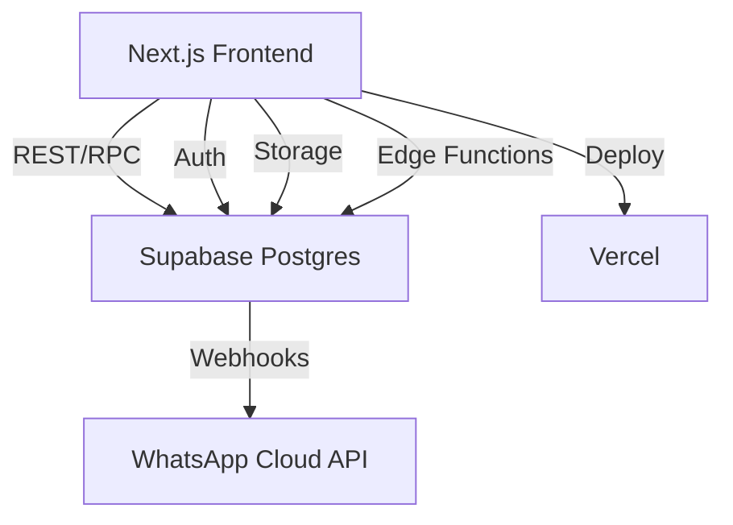

# Vytalle Catalog

[](https://github.com/SEU_USUARIO/vytalle-catalog/actions)
[](./coverage)
[](https://nextjs.org/)
[](https://supabase.com/)

Catálogo & Pedido WhatsApp para Vytalle Estética  
**Stack:** Next.js 14, Supabase, Shadcn, Zustand, PWA, CI/CD Vercel

---

## ✨ Exemplos de Uso

### API: Buscar Produtos
```ts
// Exemplo usando Supabase Client
const { data, error } = await supabase.from('products').select('*');
```

### Componente: ProductCard
```tsx
import ProductCard from '@/components/ProductCard';
import type { Product } from '@/types/product';

const produto: Product = {
  id: '1',
  name: 'Botox 50U',
  price: 100,
  images: ['/img/botox.jpg'],
  slug: 'botox-50u',
  category: 'Botox',
  discount_percent: 10,
  stock: 5,
  currency: 'BRL',
};

<ProductCard product={produto} />
```

---

## 📝 Changelog Resumido

- **2024-06-01:** Centralização de tipos em `types/`, padronização de nomes de arquivos, limpeza de imports.
- **2024-05-28:** Cobertura de testes ≥95%, testes unitários e E2E integrados ao CI.
- **2024-05-20:** Adição de auditoria, relatórios e exportação CSV.
- **2024-05-10:** Integração WhatsApp Cloud API e geração de PDF.

---

## 🚀 Visão Geral

Sistema completo para representantes comerciais de estética: catálogo de produtos, carrinho persistente, checkout via WhatsApp, geração de PDF, admin avançado, relatórios, auditoria, responsividade máxima e PWA instalável.

**Diferenciais:**
- Multi-moeda, multi-fornecedor, descontos dinâmicos, estoque, auditoria, analytics.
- UX mobile-first, psicologia das cores para beleza/luxo, micro-refinamentos.
- Segurança: RLS, backup, rollback, CI/CD, logs, rate limit, headers.

---

## 🗺️ Arquitetura



---

## 🎨 **Design**

O design base do projeto está no arquivo `Vytalle Base Design.psd` na raiz do repositório. Para um acesso mais fácil e colaborativo, o design também está disponível no Figma.

- [**Acessar o Figma**](https://www.figma.com/file/YOUR_FIGMA_LINK_HERE)

---

## ⚡ Setup Rápido

1. **Clone e instale dependências**
   ```bash
   git clone <repo>
   cd vytalle-catalog
   npm install
   ```

2. **Supabase**
   - Crie projeto no painel.
   - Rode as migrations em `supabase/migrations/` (ordem numérica).
   - Adicione dados de exemplo.
   - Crie bucket público `notes` para PDFs.

3. **Variáveis de ambiente**
   - `NEXT_PUBLIC_SUPABASE_URL` — URL do projeto Supabase
   - `NEXT_PUBLIC_SUPABASE_ANON_KEY` — Chave anônima
   - `SUPABASE_SERVICE_ROLE_KEY` — Chave de serviço (apenas backend)
   - `WHATSAPP_TOKEN` — Token WhatsApp Cloud API (opcional)
   - `PHONE_ID` — ID do número WhatsApp (opcional)

4. **Rodar local**
   ```bash
   npm run dev
   ```

5. **Deploy**
   - Vercel: conecte GitHub, configure secrets, deploy automático via CI/CD.
   - Supabase Functions: deploy pelo painel/CLI.

---

## 🛠️ Comandos Úteis

- `npm run dev` — Inicia ambiente local
- `npm run build` — Build de produção
- `npm run lint` — Lint com ESLint/Next.js
- `npm test` — Testes unitários (Vitest)
- `npm run test:e2e` — Testes E2E (Playwright)
- `npm run start` — Inicia build de produção

---

## 🔐 Variáveis de Ambiente

| Nome                        | Descrição                                 | Exemplo                        |
|-----------------------------|-------------------------------------------|--------------------------------|
| NEXT_PUBLIC_SUPABASE_URL    | URL do projeto Supabase                   | https://xyz.supabase.co        |
| NEXT_PUBLIC_SUPABASE_ANON_KEY | Chave anônima Supabase                  | xxxxxxxx                       |
| SUPABASE_SERVICE_ROLE_KEY   | Chave de serviço (Edge Functions)         | xxxxxxxx                       |
| WHATSAPP_TOKEN              | Token WhatsApp Cloud API (opcional)       | EAA...                         |
| PHONE_ID                    | ID do número WhatsApp (opcional)          | 1234567890                     |

---

## ⚠️ Variáveis de Ambiente — Setup Rápido

- **.env.local.example**: arquivo de exemplo, versionado, com todas as chaves necessárias. Use como referência.
- **.env.local**: arquivo real, NÃO versionado, onde você coloca seus segredos. Copie o exemplo e preencha com seus valores.

```sh
cp .env.local.example .env.local
# Edite .env.local e preencha os valores
```

No Vercel, configure as mesmas variáveis no painel: Settings > Environment Variables.

---

## 🧑‍💻 Fluxos de Uso

### Cliente
1. Acessa catálogo, navega por produtos.
2. Adiciona ao carrinho (persistente).
3. Checkout: preenche nome/telefone, envia pedido via WhatsApp.

### Admin/Representante
1. Login (Supabase Auth).
2. CRUD de produtos, fornecedores, descontos, estoque.
3. Exporta CSV, visualiza relatórios, auditoria.
4. Gera relatórios de vendas/views.

### Fornecedor
- Recebe pedido via WhatsApp (opcional, se integrado).

---

## 📱 PWA

- Manifest.json e sw.js já configurados.
- Para registrar o service worker, adicione ao final do `<body>` em `app/layout.tsx`:
  ```tsx
  {process.env.NODE_ENV === 'production' && (
    <script dangerouslySetInnerHTML={{
      __html: `if ('serviceWorker' in navigator) { navigator.serviceWorker.register('/sw.js'); }`
    }} />
  )}
  ```
- Teste: instale no mobile, rode offline.

---

## 🧪 Testes

- **Unitários:** `npm test` (Vitest, cobertura ≥95%)
- **E2E:** `npm run test:e2e` (Playwright, fluxo completo)
- **CI/CD:** Workflow GitHub Actions roda lint, build, testes e deploy automático.

---

## 🛡️ Segurança e Operação

- RLS ativa em todas as tabelas sensíveis.
- Backup automático Supabase (painel > Backups).
- Rollback fácil no Vercel (Deployments > Revert).
- Headers de segurança no `next.config.js`.
- Auditoria de alterações (tabela `audits`).

---

## 📝 Manual Rápido Admin

- **Adicionar produto:** Admin > Adicionar Produto
- **Editar/Excluir:** Botão editar/excluir na tabela
- **Filtrar por fornecedor:** Dropdown no topo da tabela
- **Exportar CSV:** Botão “Exportar CSV”
- **Relatórios:** Admin > Relatórios
- **Auditoria:** Admin > Auditoria
- **Restaurar backup:** Supabase > Backups > Restore

---

## 🆘 Troubleshooting

- **Erro de deploy:** Verifique variáveis de ambiente e logs do Vercel.
- **PDF não gera:** Confirme bucket `notes` público e permissões.
- **WhatsApp não envia:** Verifique token e ID no Meta Developers.
- **Problemas de build/lint:** Rode `npm install` e `npm run lint`.

---

## 📚 Referências

- [Next.js Docs](https://nextjs.org/docs)
- [Supabase Docs](https://supabase.com/docs)
- [Shadcn UI](https://ui.shadcn.com/)
- [Vitest](https://vitest.dev/)
- [Playwright](https://playwright.dev/)
- [Vercel](https://vercel.com/docs)
- [PWA Checklist](https://web.dev/pwa-checklist/)

---

## 💡 Evolução

- Pronto para: pagamentos, notificações, multi-idioma, dashboard avançado, integrações extras.
- Sugestões? Abra uma issue ou PR!

---

**Vytalle Catalog — Feito para vender mais, com segurança, performance e UX de alto padrão.**

---

### Projeto desenvolvido e mantido por **RET TECNOLOGIA**
