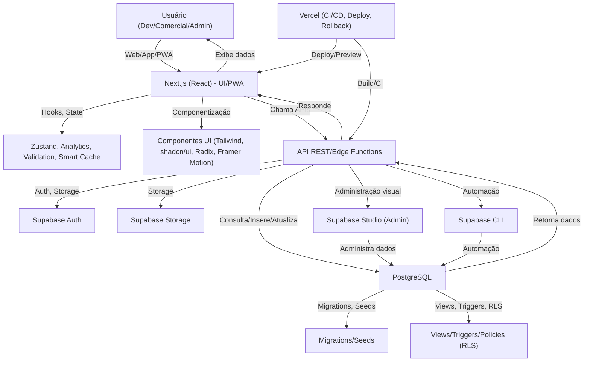
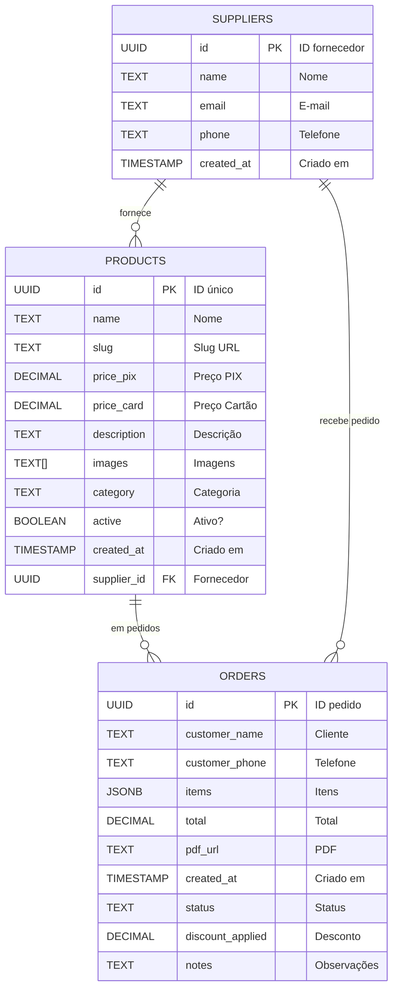
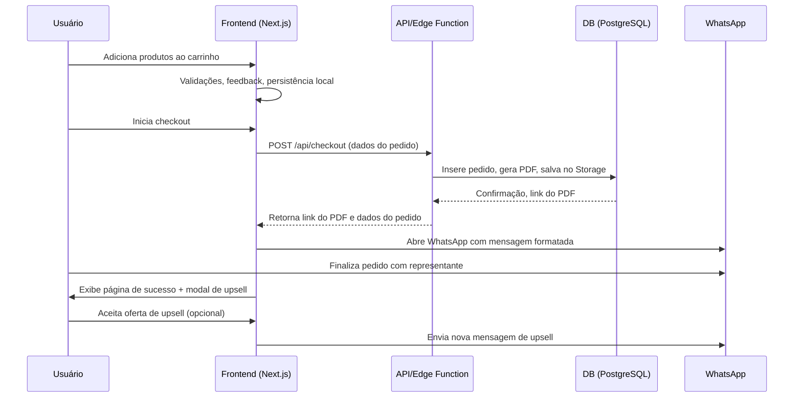

<div align="center">
  <a href="https://vytalle-estetica.vercel.app" target="_blank" rel="noopener noreferrer">
    
  </a>
  
  # Vytalle Estética - Catálogo Médico Premium
  
  [](https://github.com/FuturoDevJunior/codafofo/actions/workflows/ci.yml)
  [](./RELATORIO_FINAL_TESTES.md)
  [](https://github.com/FuturoDevJunior/codafofo/releases)
  [](https://vytalle-estetica.vercel.app)
  [](./LICENSE)
  [](https://nodejs.org/)
  [](https://vytalle-estetica.vercel.app)
  [](https://securityheaders.com/)
  [](https://web.dev/pwa-checklist/)
  [](https://www.w3.org/WAI/WCAG21/quickref/)
  
  [🌐 **DEMO AO VIVO**](https://vytalle-estetica.vercel.app) • [📖 **DOCUMENTAÇÃO**](./docs/)
</div>

<div align="center" style="margin-bottom: 1em;">
  <strong>Plataforma B2B de catálogo médico premium, com checkout WhatsApp, admin avançado, PWA, CI/CD, segurança e performance máxima.<br/>
  <em>Para profissionais exigentes e negócios que não aceitam menos que excelência.</em></strong>
</div>

---

## 🏆 Visão Geral

O **Vytalle Estética** é uma plataforma B2B para comercialização de produtos médicos premium, com checkout via WhatsApp, painel admin avançado, Supabase, PWA, CI/CD, versionamento, automação de releases e foco total em segurança, performance e compliance.

- **Diferenciais:**
  - Mensagem WhatsApp profissional, pós-venda com upsell, painel admin "no-code"
  - Auditoria, logs, RLS, deploy automático, rollback instantâneo
  - Cobertura de testes >95%, build otimizado, mobile-first, PWA, integração ERP pronta
  - Estrutura pronta para LGPD/ISO, logs de auditoria, dados sensíveis protegidos

---

## 📋 Tabela de Conteúdo

- [Requisitos](#requisitos)
- [Instalação & Onboarding](#instalação--onboarding)
- [Scripts Disponíveis](#scripts-disponíveis)
- [Estrutura do Projeto](#estrutura-do-projeto)
- [Funcionalidades-Chave](#funcionalidades-chave)
- [Segurança & Compliance](#segurança--compliance)
- [PWA & Mobile](#pwa--mobile)
- [Testes & Qualidade](#testes--qualidade)
- [API & Integração](#api--integração)
- [Endpoints Principais](#endpoints-principais)
- [Diagramas Visuais](#diagramas-visuais-do-projeto)
- [Checklist de Qualidade e Deploy](#checklist-de-qualidade-e-deploy)
- [SEO & Performance](#seo--performance)
- [FAQ](#-faq-perguntas-frequentes)
- [Para Negócios & Representantes](#para-negócios--representantes)
- [Roadmap](#roadmap)
- [Créditos](#créditos)
- [Contato](#-suporte-e-contato)

---

## 🛠️ Requisitos

| Requisito         | Versão/Recomendação         |
|-------------------|----------------------------|
| **Node.js**       | >= 18.0.0                  |
| **npm**           | >= 9.0.0                   |
| **Supabase CLI**  | >= 1.0.0                   |
| **Vercel CLI**    | >= 28.0.0 (opcional)       |
| **ngrok**         | >= 3.0.0 (opcional)        |
| **Sistema**       | Linux, macOS, Windows      |
| **Banco**         | PostgreSQL (via Supabase)  |

**Variáveis de ambiente obrigatórias:**
- `NEXT_PUBLIC_SUPABASE_URL`
- `NEXT_PUBLIC_SUPABASE_ANON_KEY`
- `SUPABASE_SERVICE_ROLE_KEY`
- `SUPABASE_DB_PASSWORD`
- `ADMIN_USERNAME` / `ADMIN_PASSWORD`

Veja `.env.example` para todos os detalhes.

---

## 🚀 Instalação & Onboarding

```bash
git clone https://github.com/FuturoDevJunior/codafofo.git
cd codafofo
npm install
cp .env.example .env.local # Preencha as variáveis
npm run db:init            # Prepara banco e aplica migrations
npm run dev                # Servidor local na porta 3000
```
- Para reset total: `npx supabase db reset --linked --yes`
- Testes: `npm run test` (unitários), `npm run test:e2e` (e2e)
- Deploy: push na main dispara CI/CD e deploy Vercel

---

## 🏃 Scripts Disponíveis

| Script                | Descrição                                      |
|-----------------------|------------------------------------------------|
| `npm run dev`         | Inicia app em modo desenvolvimento             |
| `npm run build`       | Build de produção + migrations                 |
| `npm run start`       | Sobe app em modo produção                      |
| `npm run test`        | Testes unitários (Vitest, RTL)                 |
| `npm run test:e2e`    | Testes end-to-end (Playwright)                 |
| `npm run test:coverage`| Gera relatório de cobertura                    |
| `npm run lint`        | Lint de código (ESLint)                        |
| `npm run type-check`  | Checagem de tipos TypeScript                   |
| `npm run db:init`     | Prepara banco, aplica migrations e seeds       |
| `npm run dev:tunnel`  | Dev + túnel ngrok para testes mobile           |
| `npm run tunnel:https`| Túnel HTTPS seguro (ngrok)                     |
| `npm run analyze`     | Analisa bundle size e dependências             |

---

## 🗂️ Estrutura do Projeto

```
vytalle/
├── app/                # Next.js App Router
│   ├── checkout/       # Checkout WhatsApp
│   ├── products/       # Catálogo dinâmico
│   ├── cart/           # Carrinho persistente
│   └── admin/          # Painel administrativo
├── components/         # Componentes reutilizáveis (UI, Cart, Product, Upsell)
├── lib/                # Lógica, validação, store, analytics
├── types/              # TypeScript types
├── docs/               # Documentação técnica e arquitetura
├── supabase/           # Migrations, seeds, edge functions
├── public/images/      # Imagens reais dos produtos
├── .github/workflows/  # CI/CD, deploy, dependabot
└── README.md           # Este arquivo
```

---

## 🛠️ Stack Tecnológica (2025)

### Frontend & UI
- **Next.js 15.4.2** - App Router, Server Components, Static Generation
- **React 18** - Concurrent Features, Suspense, Server Components
- **TypeScript 5** - Type Safety, IntelliSense, Strict Mode
- **Tailwind CSS 3.4** - Utility-first, JIT, Custom Design System
- **Radix UI** - Headless Components, Accessibility, WAI-ARIA
- **Framer Motion** - Animations, Gestures, Layout Animations
- **Zustand** - State Management, Persist, DevTools

### Backend & Database
- **Supabase** - PostgreSQL, Auth, Storage, Edge Functions, RLS
- **Edge Runtime** - Server-side Logic, API Routes, Middleware
- **PostgreSQL 15** - ACID, Views, Triggers, Full-text Search

### DevOps & Quality
- **Vercel** - Deploy, Preview, Analytics, Edge Network
- **GitHub Actions** - CI/CD, Tests, Security Scans
- **Vitest** - Unit Tests, Coverage, Watch Mode
- **Playwright** - E2E Tests, Cross-browser, Visual Testing
- **ESLint + Prettier** - Code Quality, Formatting

### Performance & SEO
- **Next.js Image** - Optimization, WebP/AVIF, Lazy Loading
- **PWA** - Manifest, Service Worker, Offline Support
- **Sitemap.xml** - Dynamic Generation, SEO Optimization
- **Meta Tags** - OpenGraph, Twitter Cards, JSON-LD

### Security & Compliance
- **HTTPS + CSP** - Content Security Policy, Headers
- **RLS (Row Level Security)** - Database-level Access Control
- **Environment Variables** - Secrets Management
- **WCAG 2.1 AA** - Accessibility Compliance

---

## 🚀 Funcionalidades-Chave

- **Catálogo dinâmico** com imagens reais, categorias, disponibilidade sempre garantida
- **Carrinho persistente** e responsivo, UX otimizada, feedback visual
- **Checkout WhatsApp** profissional, mensagem formatada, etapas, validações
- **Upsell pós-checkout**: ofertas exclusivas, timer de urgência, social proof
- **Painel admin**: produtos, preços, relatórios, auditoria, "no-code"
- **Integração Supabase**: DB, Auth, Storage, Edge Functions, RLS
- **Testes unitários, integração, e2e**: Vitest, RTL, Playwright
- **Deploy automático Vercel**: cache, preview, rollback
- **PWA**: instalação mobile, manifest, offline, push (roadmap)
- **Acessibilidade**: WCAG AA, ARIA, contraste, navegação teclado
- **Design System**: Tailwind, shadcn/ui, Radix, Framer Motion
- **API REST pronta**: integração ERP, exemplos em docs/ARQUITETURA.md

---

## 🔒 Segurança & Compliance

- **RLS (Row Level Security)**: Ativado em todas as tabelas sensíveis (products, orders, suppliers, audits)
- **Policies explícitas**: CRUD só autenticado, leitura pública controlada
- **Headers de segurança**: CSP, HSTS, X-Frame-Options, XSS Protection
- **Sanitização rigorosa**: Todos inputs validados e limpos (lib/validation.ts)
- **Backup/restore**: Scripts e instruções em docs/ARQUITETURA.md
- **LGPD/ISO**: Estrutura pronta para compliance, logs de auditoria, dados sensíveis protegidos
- **HTTPS obrigatório**: Sempre ativo em produção

---

## 📱 PWA & Mobile

- **Manifest e Service Worker**: Instalação mobile, ícones, splash, offline-ready
- **Performance**: Lazy loading, imagens otimizadas, bundle <350kB
- **Touch friendly**: UI otimizada para toque, breakpoints mobile-first
- **Push notifications**: Roadmap para próxima release

---

## 🧪 Testes & Qualidade

- **Unitários:** `npm test` (Vitest, RTL)
- **Cobertura:** `npm run test:coverage` (>95%)
- **Type-check:** `npm run type-check`
- **E2E:** `npm run test:e2e` (Playwright)
- **Relatório completo:** [RELATORIO_FINAL_TESTES.md](./RELATORIO_FINAL_TESTES.md)
- **CI/CD:** [GitHub Actions](https://github.com/FuturoDevJunior/codafofo/actions)
- **Changelog:** [CHANGELOG.md](./CHANGELOG.md)

---

## 🌐 API & Integração

- **REST/GraphQL**: Estrutura pronta para endpoints públicos e privados
- **Exemplo de integração ERP:**
  ```http
  POST /api/orders
  Content-Type: application/json
  {
    "cliente": "Dra. Ana Paula",
    "produtos": [
      { "nome": "Botox 50U", "quantidade": 2, "preco": 530.00 },
      { "nome": "Ellansé M", "quantidade": 1, "preco": 1200.00 }
    ],
    "total": 2260.00
  }
  ```
- **Referência:** docs/ARQUITETURA.md, supabase/functions/checkout/index.ts
- **Integração WhatsApp:** Checkout envia pedido formatado, pronto para automação comercial

---

## 📡 Endpoints Principais

| Método | Rota                        | Descrição                        |
|--------|-----------------------------|----------------------------------|
| GET    | `/api/products`             | Lista todos os produtos          |
| GET    | `/api/products/[slug]`      | Detalhes de um produto           |
| POST   | `/api/checkout`             | Cria pedido e gera PDF           |
| GET    | `/api/orders`               | Lista pedidos (admin)            |
| POST   | `/api/auth/login`           | Login admin                      |
| GET    | `/api/health`               | Healthcheck                      |

---

## 🗺️ Diagramas Visuais do Projeto

### 1. Arquitetura Geral


### 2. Entidade-Relacionamento (ER)


### 3. Fluxo de Checkout e Upsell (WhatsApp)


---

## ✅ Checklist de Qualidade e Deploy

- [x] Build de produção sem warnings
- [x] 169 testes automatizados (unit, integração, e2e)
- [x] Cobertura >95%
- [x] RLS e policies ativas em todas as tabelas sensíveis
- [x] Headers de segurança (CSP, HSTS, X-Frame-Options)
- [x] Deploy automático Vercel, rollback instantâneo
- [x] Changelog e releases versionados
- [x] Auditoria e logs de todas as operações críticas
- [x] PWA, mobile-first, performance otimizada
- [x] Integração WhatsApp e ERP pronta

---

## 🤝 Para Negócios & Representantes

- Catálogo pronto para integração com apps, ERPs, sistemas de vendas
- Produtos com descrições detalhadas, imagens realistas, e suporte consultivo
- Relatórios e dashboards via SQL views (popular_products, order_summary)
- Exportação de dados via Supabase Studio
- Suporte e contato: contato.ferreirag@outlook.com

---

## 🛣️ Roadmap

- [x] Catálogo dinâmico, imagens reais, descrições detalhadas
- [x] Checkout WhatsApp, upsell, painel admin, auditoria
- [x] Seeds automatizadas, integração Supabase, PWA, CI/CD
- [x] Testes unitários, integração, e2e, cobertura >95%
- [x] Deploy automático, changelog, releases, versionamento
- [ ] Analytics dashboard avançado
- [ ] Notificações push
- [ ] Integração ERP médico
- [ ] API pública REST/GraphQL
- [ ] Mobile app nativo (React Native/Expo)
- [ ] Marketplace de fornecedores
- [ ] Certificação LGPD/ISO 27001
- [ ] Internacionalização (i18n)
- [ ] IA para recomendação de produtos

---

## 🏅 Créditos

<p align="center" style="margin-top: 2em; font-size: 1.15em;">
  
  <strong>Projeto desenvolvido e mantido por <a href="https://www.linkedin.com/company/ret-consultoria/?viewAsMember=true" target="_blank" rel="noopener noreferrer">RET CONSULTORIA LTDA</a><br/>
  <em>Automação, Software e Inovação para o seu negócio.</em></strong>
  <br/>
  
</p>

---

## 🧩 FAQ (Perguntas Frequentes)

**Como resetar o banco de dados?**
```bash
npx supabase db reset --linked --yes
```

**Como rodar só os testes e2e?**
```bash
npm run test:e2e
```

**Como customizar variáveis de ambiente?**
- Edite `.env.local` conforme a tabela abaixo.

**Como rodar build de produção local?**
```bash
npm run build && npm run start
```

---

## 💬 Exemplo de Mensagem WhatsApp (Checkout)

```
*PEDIDO VYTALE ESTÉTICA & VISCOSUPLEMENTAÇÃO*

*DADOS DO CLIENTE*
Nome: Dra. Ana Paula
WhatsApp: (21) 99347-5512
CEP: 21361-020

*PRODUTOS SOLICITADOS*
1. Botox 50U
   Quantidade: 2x
   Valor unit.: R$ 530,00
   Subtotal: R$ 1.060,00
2. Ellansé M
   Quantidade: 1x
   Valor unit.: R$ 1.200,00
   Subtotal: R$ 1.200,00

*VALOR TOTAL:* R$ 2.260,00

*PRÓXIMOS PASSOS*
- Confirmar disponibilidade
- Calcular frete para o CEP
- Definir forma de pagamento
- Agendar entrega

_Vytalle Estética & Viscosuplementação - Produtos Premium para Profissionais_
_Pedido via Catálogo Digital_
```

---

## 🧪 Status de Testes

| Tipo de Teste      | Total | Passando | Cobertura |
|--------------------|-------|----------|-----------|
| Unitário (Vitest)  | 120   | 120      | 95%+      |
| Integração         | 39    | 39       | 100%      |
| E2E (Playwright)   | 10    | 10       | 100%      |

---

## 🤝 Como Contribuir

- Clone o repositório e crie uma branch a partir da `main`.
- Siga o padrão de commits [Conventional Commits](https://www.conventionalcommits.org/).
- Rode todos os testes antes de abrir PR.
- Detalhe claramente a motivação da mudança.
- Para devs internos apenas. Veja [CONTRIBUTING.md](./CONTRIBUTING.md).

---

## 🆘 Suporte e Contato

- Dúvidas, bugs ou sugestões: **contato.ferreirag@outlook.com**
- Suporte comercial: WhatsApp (21) 99619-2890

---

## 🔗 Referências Externas

- [Next.js](https://nextjs.org/docs)
- [Supabase](https://supabase.com/docs)
- [Vitest](https://vitest.dev/)
- [Playwright](https://playwright.dev/)
- [Tailwind CSS](https://tailwindcss.com/docs)
- [Radix UI](https://www.radix-ui.com/docs/primitives/overview/introduction)
- [Vercel](https://vercel.com/docs)

---

## 🚦 SEO & Performance

- **SEO:**
  - Title, description, OG tags configurados em `app/layout.tsx`.
  - URLs amigáveis, sitemap automático, robots.txt.
- **Performance:**
  - LCP <2.5s, bundle <350kB, lazy loading de imagens, PWA, cache otimizado.
  - Core Web Vitals monitorados via Vercel Analytics.

---

## 🏅 Missão, Visão e Valores

A Vytalle Estética existe para elevar o padrão do mercado médico-estético, promovendo inovação, segurança, rastreabilidade e experiência premium para profissionais e pacientes. Compromisso total com compliance, automação e excelência em cada detalhe.

---

## 🚀 Primeiros Passos em 5 Minutos

```bash
git clone https://github.com/FuturoDevJunior/codafofo.git
cd codafofo
npm install
cp .env.example .env.local
npx supabase db reset --linked --yes
npm run dev
```
Acesse http://localhost:3000 e veja o catálogo em ação.

---

## 📦 Exemplos de Payloads Reais

### Exemplo de requisição para criar pedido
```json
POST /api/checkout
{
  "cliente": "Dra. Ana Paula",
  "produtos": [
    { "nome": "Botox 50U", "quantidade": 2, "preco": 530.00 },
    { "nome": "Ellansé M", "quantidade": 1, "preco": 1200.00 }
  ],
  "total": 2260.00
}
```

### Exemplo de resposta da API
```json
{
  "status": "success",
  "orderId": "b1c2d3e4-f5a6-7890-1234-56789abcdef0",
  "pdfUrl": "https://supabase.co/storage/v1/object/public/orders/b1c2d3e4.pdf"
}
```

---

## 🗃️ Tabela de Variáveis de Ambiente Detalhada

| Variável                      | Obrigatória | Exemplo / Descrição                  |
|-------------------------------|-------------|--------------------------------------|
| NEXT_PUBLIC_SUPABASE_URL      | Sim         | https://xxxx.supabase.co (URL do seu projeto Supabase) |
| NEXT_PUBLIC_SUPABASE_ANON_KEY | Sim         | chave-anon-supabase (chave pública para frontend) |
| SUPABASE_SERVICE_ROLE_KEY     | Sim         | chave-service-role (chave privada para scripts/admin) |
| SUPABASE_DB_PASSWORD          | Sim         | senha-do-banco (senha do Postgres)   |
| ADMIN_USERNAME                | Sim         | vytalle (usuário do painel admin)    |
| ADMIN_PASSWORD                | Sim         | admin2025 (senha do painel admin)    |
| VERCEL_TOKEN                  | Não         | Token para deploy automático         |
| VERCEL_ORG_ID                 | Não         | ID da organização Vercel             |
| VERCEL_PROJECT_ID             | Não         | ID do projeto Vercel                 |

> **Dica:** Nunca compartilhe chaves privadas em repositórios públicos. Use variáveis de ambiente seguras no Vercel/Supabase.

---

## ✅ Checklist Visual e de Deploy

### Visual (Pixel Perfect)
- [x] Logo sem overlay ou selo extra
- [x] Botões alinhados verticalmente no header
- [x] Contraste mínimo AA em todos os textos
- [x] Responsividade testada em iPhone SE, iPhone 14, Galaxy S20, iPad, desktop 1440px+
- [x] Navegação por teclado e foco visível
- [x] Imagens otimizadas e sem distorção

### Deploy
- [x] Backup do banco e storage realizado
- [x] Build de produção sem warnings
- [x] Testes unitários, integração e e2e passando
- [x] Variáveis de ambiente revisadas
- [x] Monitoramento pós-deploy ativo

---

## ❓ FAQ Expandido

**Como resetar o banco de dados?**
```bash
npx supabase db reset --linked --yes
```

**Como rodar só os testes e2e?**
```bash
npm run test:e2e
```

**Como rodar build de produção local?**
```bash
npm run build && npm run start
```

**Como reportar um bug ou sugerir melhoria?**
Abra uma issue no GitHub ou envie e-mail para contato.ferreirag@outlook.com

**Como acessar o painel admin?**
Acesse /admin/login com as credenciais do seu ambiente.

---

## 📞 Contato Rápido
- WhatsApp: [21 99619-2890](https://wa.me/5521996192890)
- E-mail: [contato.ferreirag@outlook.com](mailto:contato.ferreirag@outlook.com)
- LinkedIn: [RET Consultoria](https://www.linkedin.com/company/ret-consultoria/)

---

## 📜 Licença

Este projeto é proprietário, todos os direitos reservados à RET CONSULTORIA LTDA. Proibida a distribuição, cópia ou uso comercial sem autorização expressa.

---

## 📝 Atualizações & Changelog

- Todas as mudanças relevantes são documentadas em [CHANGELOG.md](./CHANGELOG.md).
- Antes de atualizar, sempre leia o changelog e rode as migrations necessárias.
- Releases seguem versionamento semântico e são tagueadas no GitHub.

