# 🏗️ Arquitetura Técnica - Vytalle Estética

> **Documentação técnica completa da arquitetura, decisões de design e padrões
> utilizados**

## 📋 Índice

- [Visão Geral da Arquitetura](#visão-geral-da-arquitetura)
- [Stack Tecnológica](#stack-tecnológica)
- [Estrutura de Pastas](#estrutura-de-pastas)
- [Padrões de Design](#padrões-de-design)
- [Fluxo de Dados](#fluxo-de-dados)
- [Segurança](#segurança)
- [Performance](#performance)
- [Escalabilidade](#escalabilidade)
- [Monitoramento](#monitoramento)
- [Decisões Técnicas](#decisões-técnicas)

---

## 🎯 Visão Geral da Arquitetura

O Vytalle Estética segue uma arquitetura **moderna e escalável** baseada em:

### Princípios Arquiteturais

- **Separation of Concerns**: Separação clara de responsabilidades
- **Single Responsibility**: Cada componente tem uma responsabilidade única
- **Dependency Injection**: Inversão de dependências
- **Immutable Data**: Dados imutáveis para previsibilidade
- **Type Safety**: TypeScript em toda a aplicação
- **Performance First**: Otimizações desde o design

### Arquitetura em Camadas


---

## 🛠️ Stack Tecnológica

### Frontend

| Tecnologia        | Versão | Propósito                   |
| ----------------- | ------ | --------------------------- |
| **Next.js**       | 15.4.2 | Framework React com SSR/SSG |
| **React**         | 18.3.1 | Biblioteca de UI            |
| **TypeScript**    | 5.4.2  | Type safety e DX            |
| **Tailwind CSS**  | 3.4.1  | Utility-first CSS           |
| **Radix UI**      | 1.0.4  | Headless components         |
| **Framer Motion** | 11.0.8 | Animações                   |
| **Zustand**       | 4.5.2  | State management            |

### Backend

| Tecnologia             | Versão   | Propósito            |
| ---------------------- | -------- | -------------------- |
| **Supabase**           | Latest   | Backend-as-a-Service |
| **PostgreSQL**         | 15       | Database principal   |
| **Edge Functions**     | Latest   | Serverless functions |
| **Row Level Security** | Built-in | Security policies    |

### DevOps & Quality

| Tecnologia         | Versão | Propósito        |
| ------------------ | ------ | ---------------- |
| **Vercel**         | Latest | Deploy e hosting |
| **GitHub Actions** | Latest | CI/CD            |
| **Vitest**         | 3.2.4  | Unit testing     |
| **Playwright**     | 1.42.1 | E2E testing      |
| **ESLint**         | 8.57.0 | Code linting     |
| **Prettier**       | 3.2.5  | Code formatting  |

---

## 📁 Estrutura de Pastas

```
vytalle/
├── app/                          # Next.js App Router
│   ├── (routes)/                 # Route groups
│   │   ├── admin/                # Admin routes
│   │   ├── products/             # Product routes
│   │   ├── cart/                 # Cart routes
│   │   └── checkout/             # Checkout routes
│   ├── api/                      # API routes
│   │   ├── auth/                 # Authentication
│   │   ├── checkout/             # Checkout API
│   │   └── products/             # Products API
│   ├── globals.css               # Global styles
│   ├── layout.tsx                # Root layout
│   └── page.tsx                  # Home page
├── components/                   # Reusable components
│   ├── ui/                       # Base UI components
│   │   ├── button.tsx
│   │   ├── input.tsx
│   │   └── dialog.tsx
│   ├── admin/                    # Admin components
│   ├── cart/                     # Cart components
│   └── products/                 # Product components
├── lib/                          # Business logic
│   ├── supabase.ts               # Database client
│   ├── auth.ts                   # Authentication
│   ├── validation.ts             # Data validation
│   ├── utils.ts                  # Utilities
│   └── store.ts                  # State management
├── types/                        # TypeScript types
│   ├── product.ts
│   ├── cart.ts
│   └── user.ts
├── supabase/                     # Database
│   ├── migrations/               # Database migrations
│   ├── functions/                # Edge functions
│   └── seeds/                    # Seed data
├── public/                       # Static assets
│   ├── images/                   # Product images
│   └── icons/                    # App icons
├── docs/                         # Documentation
├── tests/                        # Test files
└── scripts/                      # Build scripts
```

---

## 🎨 Padrões de Design

### 1. Component Architecture

```typescript
// Padrão: Compound Components
interface ProductCardProps {
  product: Product;
  variant?: 'default' | 'compact';
  onAddToCart?: (product: Product) => void;
}

export function ProductCard({ product, variant = 'default', onAddToCart }: ProductCardProps) {
  return (
    <div className={cn("product-card", variant === 'compact' && "compact")}>
      <ProductCard.Image src={product.images[0]} alt={product.name} />
      <ProductCard.Content>
        <ProductCard.Title>{product.name}</ProductCard.Title>
        <ProductCard.Price price={product.price_pix} />
      </ProductCard.Content>
      <ProductCard.Actions onAddToCart={onAddToCart} />
    </div>
  );
}

// Sub-components
ProductCard.Image = ProductImage;
ProductCard.Content = ProductContent;
ProductCard.Title = ProductTitle;
ProductCard.Price = ProductPrice;
ProductCard.Actions = ProductActions;
```

### 2. Custom Hooks Pattern

```typescript
// Padrão: Custom Hooks para lógica reutilizável
export function useProducts(category?: string) {
  const [products, setProducts] = useState<Product[]>([]);
  const [loading, setLoading] = useState(true);
  const [error, setError] = useState<string | null>(null);

  useEffect(() => {
    async function fetchProducts() {
      try {
        setLoading(true);
        const data = await getProducts(category);
        setProducts(data);
      } catch (err) {
        setError(err instanceof Error ? err.message : 'Erro desconhecido');
      } finally {
        setLoading(false);
      }
    }

    fetchProducts();
  }, [category]);

  return { products, loading, error };
}
```

### 3. Service Layer Pattern

```typescript
// Padrão: Service Layer para lógica de negócio
export class ProductService {
  private static instance: ProductService;
  private cache = new Map<string, Product[]>();

  static getInstance(): ProductService {
    if (!ProductService.instance) {
      ProductService.instance = new ProductService();
    }
    return ProductService.instance;
  }

  async getProducts(category?: string): Promise<Product[]> {
    const cacheKey = category || 'all';

    if (this.cache.has(cacheKey)) {
      return this.cache.get(cacheKey)!;
    }

    const { data, error } = await supabase
      .from('products')
      .select('*')
      .eq('active', true)
      .eq(category ? 'category' : 'id', category || 'id');

    if (error) throw new Error(error.message);

    this.cache.set(cacheKey, data);
    return data;
  }

  clearCache(): void {
    this.cache.clear();
  }
}
```

### 4. Repository Pattern

```typescript
// Padrão: Repository para acesso a dados
export interface ProductRepository {
  findAll(): Promise<Product[]>;
  findById(id: string): Promise<Product | null>;
  findBySlug(slug: string): Promise<Product | null>;
  create(product: CreateProductDto): Promise<Product>;
  update(id: string, product: UpdateProductDto): Promise<Product>;
  delete(id: string): Promise<void>;
}

export class SupabaseProductRepository implements ProductRepository {
  async findAll(): Promise<Product[]> {
    const { data, error } = await supabase
      .from('products')
      .select('*')
      .eq('active', true);

    if (error) throw new Error(error.message);
    return data;
  }

  async findById(id: string): Promise<Product | null> {
    const { data, error } = await supabase
      .from('products')
      .select('*')
      .eq('id', id)
      .single();

    if (error) return null;
    return data;
  }

  // ... outros métodos
}
```

---

## 🔄 Fluxo de Dados

### 1. Fluxo de Produtos


### 2. Fluxo de Checkout

```mermaid
sequenceDiagram
    participant U as Usuário
    participant C as Cart
    participant API as API Route
    participant DB as Database
    participant W as WhatsApp
    participant S as Storage

    U->>C: Finaliza compra
    C->>API: POST /api/checkout
    API->>API: Valida dados
    API->>DB: Insere pedido
    DB-->>API: Confirmação
    API->>S: Gera PDF
    S-->>API: URL do PDF
    API->>W: Formata mensagem
    API-->>C: Resposta completa
    C-->>U: Redireciona WhatsApp
```



### 3. Fluxo de Autenticação


---

## 🔒 Segurança

### 1. Row Level Security (RLS)

```sql
-- Política para produtos
CREATE POLICY "Produtos públicos" ON products
  FOR SELECT USING (active = true);

-- Política para pedidos (apenas admin)
CREATE POLICY "Pedidos admin" ON orders
  FOR ALL USING (
    auth.role() = 'authenticated' AND
    auth.jwt() ->> 'role' = 'admin'
  );

-- Política para auditoria
CREATE POLICY "Auditoria admin" ON audits
  FOR ALL USING (
    auth.role() = 'authenticated' AND
    auth.jwt() ->> 'role' = 'admin'
  );
```

### 2. Input Validation

```typescript
// Validação rigorosa de inputs
import { z } from 'zod';

const productSchema = z.object({
  name: z
    .string()
    .min(2, 'Nome deve ter pelo menos 2 caracteres')
    .max(100, 'Nome deve ter no máximo 100 caracteres')
    .regex(/^[a-zA-Z0-9\s\-\.]+$/, 'Nome contém caracteres inválidos'),

  price_pix: z
    .number()
    .positive('Preço deve ser positivo')
    .max(10000, 'Preço muito alto'),

  category: z.enum(['Toxina Botulínica', 'Preenchedor', 'Bioestimulador']),

  images: z
    .array(z.string().url())
    .min(1, 'Pelo menos uma imagem é obrigatória')
    .max(10, 'Máximo 10 imagens'),
});

export function validateProduct(data: unknown): Product {
  return productSchema.parse(data);
}
```

### 3. Rate Limiting

```typescript
// Rate limiting por IP
const rateLimit = new Map<string, { count: number; resetTime: number }>();

export function rateLimitMiddleware(req: NextApiRequest, res: NextApiResponse) {
  const ip = req.headers['x-forwarded-for'] || req.socket.remoteAddress;
  const limit = 100; // requests per minute

  if (!ip) return res.status(400).json({ error: 'IP não identificado' });

  const now = Date.now();
  const userLimit = rateLimit.get(ip as string);

  if (!userLimit || now > userLimit.resetTime) {
    rateLimit.set(ip as string, { count: 1, resetTime: now + 60000 });
  } else if (userLimit.count >= limit) {
    return res.status(429).json({
      error: 'Rate limit exceeded',
      retryAfter: Math.ceil((userLimit.resetTime - now) / 1000),
    });
  } else {
    userLimit.count++;
  }
}
```

### 4. Security Headers

```typescript
// Headers de segurança
const securityHeaders = [
  {
    key: 'X-Frame-Options',
    value: 'DENY',
  },
  {
    key: 'X-Content-Type-Options',
    value: 'nosniff',
  },
  {
    key: 'Referrer-Policy',
    value: 'origin-when-cross-origin',
  },
  {
    key: 'Content-Security-Policy',
    value:
      "default-src 'self'; script-src 'self' 'unsafe-eval' 'unsafe-inline'; style-src 'self' 'unsafe-inline'; img-src 'self' data: https:; font-src 'self' data:;",
  },
];

// next.config.js
module.exports = {
  async headers() {
    return [
      {
        source: '/(.*)',
        headers: securityHeaders,
      },
    ];
  },
};
```

---

## ⚡ Performance

### 1. Image Optimization

```typescript
// Otimização automática de imagens
import Image from 'next/image';

export function OptimizedImage({ src, alt, ...props }: ImageProps) {
  return (
    <Image
      src={src}
      alt={alt}
      placeholder="blur"
      blurDataURL="data:image/jpeg;base64,/9j/4AAQSkZJRgABAQAAAQABAAD/2wBDAAYEBQYFBAYGBQYHBwYIChAKCgkJChQODwwQFxQYGBcUFhYaHSUfGhsjHBYWICwgIyYnKSopGR8tMC0oMCUoKSj/2wBDAQcHBwoIChMKChMoGhYaKCgoKCgoKCgoKCgoKCgoKCgoKCgoKCgoKCgoKCgoKCgoKCgoKCgoKCgoKCgoKCgoKCj/wAARCAABAAEDASIAAhEBAxEB/8QAFQABAQAAAAAAAAAAAAAAAAAAAAv/xAAUEAEAAAAAAAAAAAAAAAAAAAAA/8QAFQEBAQAAAAAAAAAAAAAAAAAAAAX/xAAUEQEAAAAAAAAAAAAAAAAAAAAA/9oADAMBAAIRAxEAPwCdABmX/9k="
      sizes="(max-width: 768px) 100vw, (max-width: 1200px) 50vw, 33vw"
      {...props}
    />
  );
}
```

### 2. Code Splitting

```typescript
// Lazy loading de componentes pesados
import dynamic from 'next/dynamic';

const AdminDashboard = dynamic(() => import('./AdminDashboard'), {
  loading: () => <AdminDashboardSkeleton />,
  ssr: false
});

const HeavyChart = dynamic(() => import('./HeavyChart'), {
  loading: () => <ChartSkeleton />
});
```

### 3. Caching Strategy

```typescript
// Estratégia de cache em camadas
export class CacheManager {
  private memoryCache = new Map<string, { data: any; expires: number }>();
  private readonly TTL = 5 * 60 * 1000; // 5 minutos

  async get<T>(key: string): Promise<T | null> {
    const cached = this.memoryCache.get(key);

    if (cached && Date.now() < cached.expires) {
      return cached.data;
    }

    return null;
  }

  set(key: string, data: any): void {
    this.memoryCache.set(key, {
      data,
      expires: Date.now() + this.TTL,
    });
  }

  clear(): void {
    this.memoryCache.clear();
  }
}
```

### 4. Bundle Optimization

```typescript
// next.config.js
const withBundleAnalyzer = require('@next/bundle-analyzer')({
  enabled: process.env.ANALYZE === 'true',
});

module.exports = withBundleAnalyzer({
  experimental: {
    optimizeCss: true,
    optimizePackageImports: ['@radix-ui/react-icons', 'framer-motion'],
  },
  webpack: (config, { dev, isServer }) => {
    if (!dev && !isServer) {
      config.optimization.splitChunks.cacheGroups = {
        vendor: {
          test: /[\\/]node_modules[\\/]/,
          name: 'vendors',
          chunks: 'all',
        },
      };
    }
    return config;
  },
});
```

---

## 📈 Escalabilidade

### 1. Horizontal Scaling

```typescript
// Arquitetura stateless para scaling horizontal
export class StatelessService {
  // Sem estado local - tudo no banco/cache
  async processRequest(data: any): Promise<any> {
    // Lógica stateless
    return await this.database.operation(data);
  }
}
```

### 2. Database Scaling

```sql
-- Índices para performance
CREATE INDEX idx_products_category ON products(category);
CREATE INDEX idx_products_active ON products(active);
CREATE INDEX idx_orders_created_at ON orders(created_at);
CREATE INDEX idx_orders_status ON orders(status);

-- Partitioning para grandes volumes
CREATE TABLE orders_2024 PARTITION OF orders
FOR VALUES FROM ('2024-01-01') TO ('2025-01-01');
```

### 3. CDN Strategy

```typescript
// Estratégia de CDN para assets estáticos
const cdnConfig = {
  images: {
    domain: 'vytalle-cdn.vercel.app',
    path: '/images',
    formats: ['webp', 'avif', 'jpg'],
    sizes: [1920, 1280, 768, 480],
  },
  static: {
    domain: 'vytalle-static.vercel.app',
    cache: 'public, max-age=31536000, immutable',
  },
};
```

---

## 📊 Monitoramento

### 1. Application Monitoring

```typescript
// Monitoramento de performance
export class PerformanceMonitor {
  static trackPageView(page: string) {
    if (typeof window !== 'undefined') {
      const navigation = performance.getEntriesByType(
        'navigation'
      )[0] as PerformanceNavigationTiming;

      analytics.track('page_view', {
        page,
        loadTime: navigation.loadEventEnd - navigation.loadEventStart,
        domContentLoaded:
          navigation.domContentLoadedEventEnd -
          navigation.domContentLoadedEventStart,
        firstPaint: performance.getEntriesByName('first-paint')[0]?.startTime,
        firstContentfulPaint: performance.getEntriesByName(
          'first-contentful-paint'
        )[0]?.startTime,
      });
    }
  }

  static trackError(error: Error, context?: any) {
    analytics.track('error', {
      message: error.message,
      stack: error.stack,
      context,
    });
  }
}
```

### 2. Database Monitoring

```sql
-- Queries para monitoramento
-- Performance de queries
SELECT
  query,
  calls,
  total_time,
  mean_time,
  rows
FROM pg_stat_statements
ORDER BY total_time DESC
LIMIT 10;

-- Tamanho das tabelas
SELECT
  schemaname,
  tablename,
  pg_size_pretty(pg_total_relation_size(schemaname||'.'||tablename)) as size
FROM pg_tables
WHERE schemaname = 'public'
ORDER BY pg_total_relation_size(schemaname||'.'||tablename) DESC;
```

### 3. Error Tracking

```typescript
// Error boundary com tracking
export class ErrorBoundary extends React.Component<Props, State> {
  constructor(props: Props) {
    super(props);
    this.state = { hasError: false, error: null };
  }

  static getDerivedStateFromError(error: Error): State {
    return { hasError: true, error };
  }

  componentDidCatch(error: Error, errorInfo: React.ErrorInfo) {
    // Track error
    analytics.track('error_boundary', {
      error: error.message,
      stack: error.stack,
      componentStack: errorInfo.componentStack,
    });

    // Send to external service
    this.reportError(error, errorInfo);
  }

  private async reportError(error: Error, errorInfo: React.ErrorInfo) {
    try {
      await fetch('/api/errors', {
        method: 'POST',
        headers: { 'Content-Type': 'application/json' },
        body: JSON.stringify({ error, errorInfo }),
      });
    } catch (e) {
      console.error('Failed to report error:', e);
    }
  }
}
```

---

## 🤔 Decisões Técnicas

### 1. Por que Next.js 15?

- **App Router**: Melhor performance e DX
- **Server Components**: Redução de JavaScript no cliente
- **Streaming**: Carregamento progressivo
- **Turbopack**: Build mais rápido
- **Edge Runtime**: Deploy global

### 2. Por que Supabase?

- **PostgreSQL**: Database robusto e confiável
- **RLS**: Segurança nativa
- **Real-time**: Atualizações em tempo real
- **Edge Functions**: Serverless functions
- **Auth**: Sistema de autenticação completo

### 3. Por que Zustand?

- **Simplicidade**: API minimalista
- **Performance**: Re-renders otimizados
- **TypeScript**: Suporte nativo
- **DevTools**: Debugging fácil
- **Bundle size**: Menor que Redux

### 4. Por que Tailwind CSS?

- **Utility-first**: Desenvolvimento rápido
- **JIT**: CSS otimizado
- **Customizable**: Design system flexível
- **Performance**: CSS final menor
- **DX**: IntelliSense excelente

---

## 📚 Recursos Adicionais

- [Next.js Architecture](https://nextjs.org/docs/architecture)
- [Supabase Best Practices](https://supabase.com/docs/guides/best-practices)
- [React Performance](https://react.dev/learn/render-and-commit)
- [TypeScript Design Patterns](https://www.typescriptlang.org/docs/)

---

**Arquitetura profissional para escalabilidade! 🚀**
