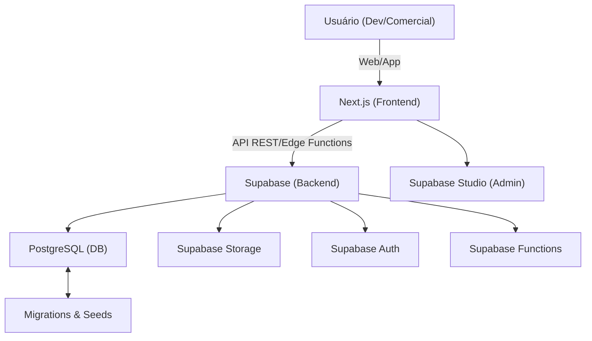
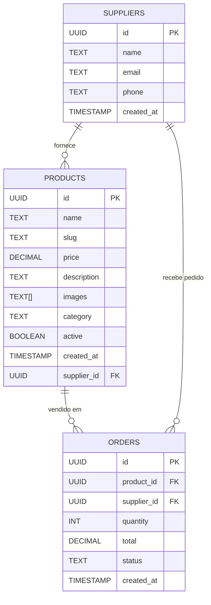
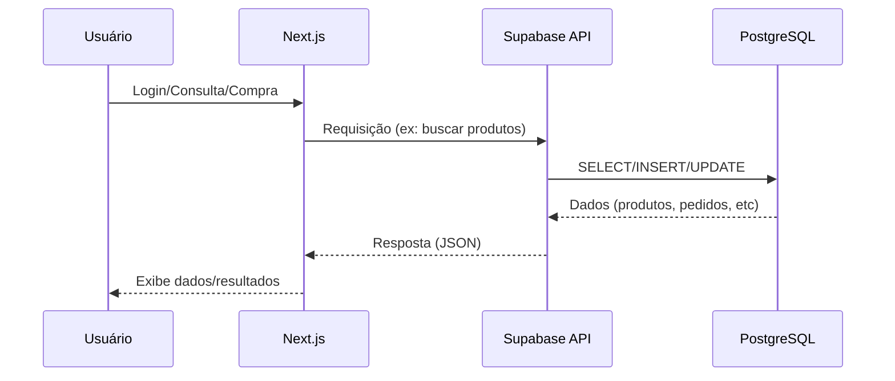
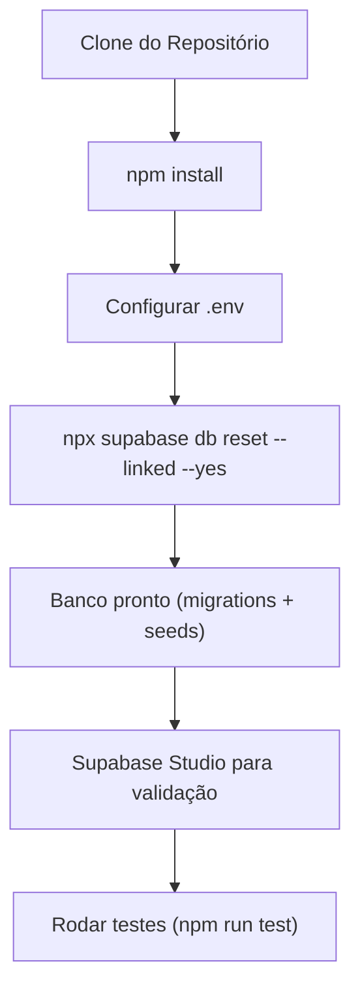
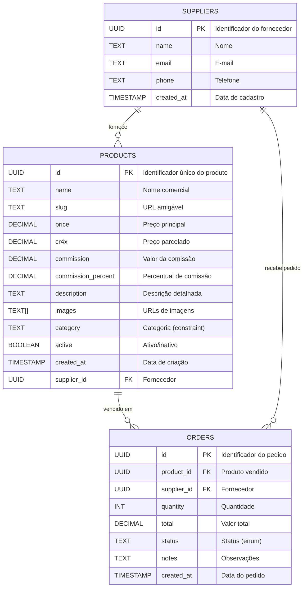
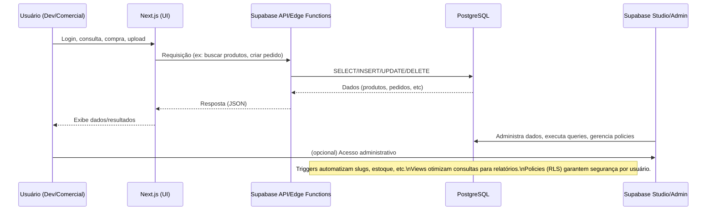
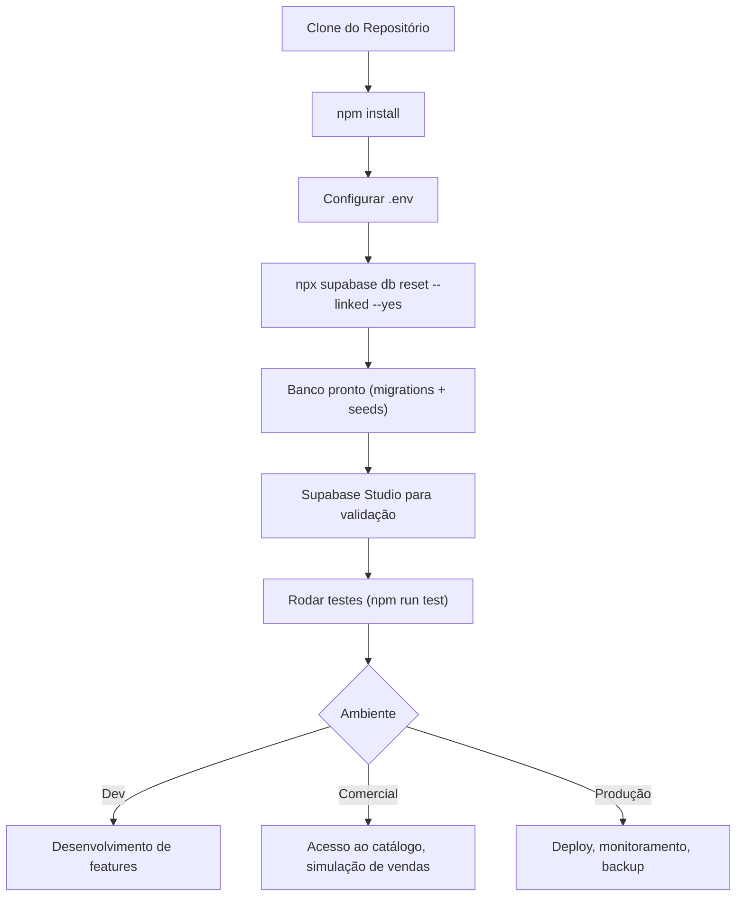

# 📦 Vitale – Documentação de Arquitetura

## 1. Visão Geral
Vitale é uma plataforma de gestão, catálogo e automação comercial para produtos estéticos, construída sobre Supabase (PostgreSQL + Auth + Storage + Functions) e Next.js. O objetivo é robustez, automação, rastreabilidade e facilidade de onboarding para devs e representantes comerciais.

---

## 2. Stack e Componentes
- **Banco de Dados:** PostgreSQL gerenciado pelo Supabase
- **Backend:** Supabase Functions (Edge Functions)
- **Frontend:** Next.js (React)
- **Storage:** Supabase Storage para imagens e documentos
- **Automação:** Supabase CLI para migrations/seeds/reset
- **Testes:** Vitest, scripts de teste funcional

---

## 3. Estrutura de Dados
- **products:** Produtos, com nome, slug, categoria, preço, descrição, imagens, estoque, fornecedor, comissão, etc.
- **orders:** Pedidos, com cliente, itens, total, PDF, status, timestamps.
- **suppliers:** Fornecedores, com nome, e-mail, telefone, endereço.
- **Views:** `popular_products`, `order_summary` para relatórios e dashboards.
- **Triggers:** Geração automática de slug, checagem de estoque.

---

## 4. Migrations e Seeds
- **Migrations:** Sequenciais, sem duplicidade, cobrem criação e expansão de tabelas, views, triggers e constraints.
- **Seeds:** Dados reais e mockados, com descrições detalhadas e imagens realistas (mockups), prontos para uso comercial.
- **Automação:** `npx supabase db reset --linked --yes` aplica tudo do zero.

---

## 5. Segurança
- **RLS (Row Level Security):** Ativado em todas as tabelas sensíveis.
- **Policies:** Políticas para leitura pública, inserção/atualização/deleção autenticada.
- **Storage:** Acesso controlado por regras do Supabase Storage.

---

### 5.1. Policies de Segurança (RLS) – Detalhamento e Exemplos

O projeto utiliza Row Level Security (RLS) em todas as tabelas sensíveis, garantindo que cada operação (leitura, escrita, atualização, deleção) seja controlada por policies explícitas. Abaixo, exemplos reais extraídos das migrations:

#### PRODUCTS
```sql
ALTER TABLE PRODUCTS ENABLE ROW LEVEL SECURITY;

-- Leitura pública (catálogo)
CREATE POLICY "Public read products" ON PRODUCTS FOR SELECT USING (TRUE);

-- Inserção, atualização e deleção apenas para usuários autenticados
CREATE POLICY "Auth insert products" ON PRODUCTS FOR INSERT WITH CHECK (AUTH.ROLE() = 'authenticated');
CREATE POLICY "Auth update products" ON PRODUCTS FOR UPDATE USING (AUTH.ROLE() = 'authenticated');
CREATE POLICY "Auth delete products" ON PRODUCTS FOR DELETE USING (AUTH.ROLE() = 'authenticated');
```

#### ORDERS
```sql
ALTER TABLE ORDERS ENABLE ROW LEVEL SECURITY;

-- Inserção apenas para autenticados
CREATE POLICY "Auth insert orders" ON ORDERS FOR INSERT WITH CHECK (AUTH.ROLE() = 'authenticated');
-- Leitura pública (exemplo: dashboard)
CREATE POLICY "Public read orders" ON ORDERS FOR SELECT USING (TRUE);
```

#### SUPPLIERS
```sql
ALTER TABLE SUPPLIERS ENABLE ROW LEVEL SECURITY;

-- CRUD apenas para autenticados
CREATE POLICY "Auth CRUD suppliers" ON SUPPLIERS FOR ALL USING (AUTH.ROLE() = 'authenticated');
```

> **Dicas e Boas Práticas:**
> - Sempre ative RLS em tabelas sensíveis.
> - Policies devem ser explícitas e restritivas por padrão.
> - Teste as policies usando o Supabase Studio (aba Policies) e scripts de teste automatizado.
> - Documente cada policy no código SQL e neste arquivo para facilitar auditoria e onboarding.

---

## 6. Backup e Deploy – Práticas Profissionais

### Backup do Banco de Dados (Supabase/Postgres)

- **Backup Manual:**
  Execute o comando abaixo para exportar todo o banco (estrutura + dados):
  ```bash
  npx supabase db dump --file backup.sql
  # Ou, para Postgres puro:
  pg_dump --clean --if-exists --no-owner --no-privileges --format=custom --file=backup.dump "$SUPABASE_DB_URL"
  ```
- **Restore Manual:**
  ```bash
  npx supabase db restore --file backup.sql
  # Ou, para Postgres puro:
  pg_restore --clean --if-exists --no-owner --no-privileges --dbname="$SUPABASE_DB_URL" backup.dump
  ```
- **Dicas:**
  - Sempre faça backup antes de rodar migrations destrutivas.
  - Armazene backups em local seguro e versionado.
  - Teste o restore periodicamente em ambiente de staging.

### Backup de Imagens e Arquivos (Supabase Storage)

- **Download manual:**
  - Use o Supabase Studio para exportar arquivos.
  - Ou utilize scripts customizados com a API do Supabase Storage.

### Deploy do Frontend/Backend

- **Deploy Automático (Vercel):**
  - O projeto já está integrado ao Vercel via GitHub Actions (`.github/workflows/deploy.yml`).
  - A cada push na branch `main`, o build, testes e deploy são executados automaticamente.
  - Status e logs podem ser acompanhados na aba "Actions" do GitHub.

- **Deploy Manual:**
  ```bash
  npm run build
  npm run start
  # Ou use o comando do Vercel CLI:
  npx vercel --prod
  ```

### Scripts Úteis

- **Inicialização do banco:**
  ```bash
  npm run db:init
  # Executa scripts/db-init.js (reset + migrations + seeds)
  ```
- **Organização de imagens:**
  ```bash
  node scripts/organize-product-images.js
  # Gera mapeamento e verifica imagens dos produtos
  ```
- **Testes funcionais:**
  ```bash
  node scripts/test-functional.mjs
  # Executa validações completas do sistema
  ```

> **Boas práticas:**
> - Automatize backups periódicos via cron ou GitHub Actions se possível.
> - Documente sempre o fluxo de restore e deploy para facilitar onboarding e disaster recovery.
> - Mantenha scripts versionados e revisados por pares.

---

## 7. Fluxo de Dados
1. **Cadastro de produtos:** Via seeds ou painel admin.
2. **Consulta e venda:** Frontend consome API/Edge Functions e exibe catálogo, preços, imagens e descrições.
3. **Pedidos:** Criados via frontend, armazenados em `orders`, PDF gerado e salvo no Storage.
4. **Relatórios:** Views SQL e funções para dashboards e relatórios comerciais.

---

## 8. Onboarding de Desenvolvedores
- Clone o repositório.
- Instale dependências (`npm install`).
- Configure variáveis de ambiente (ver `.env.example`).
- Execute `npx supabase db reset --linked --yes` para preparar o banco.
- Use o Supabase Studio para explorar e validar dados.
- Testes: `npm run test`.

---

## 9. Orientações para Representantes Comerciais
- O banco já está pronto para integração com apps, catálogos digitais e sistemas de vendas.
- Produtos possuem descrições detalhadas e imagens realistas para facilitar a apresentação ao cliente.
- Relatórios e dashboards disponíveis via views e consultas SQL.

---

## 10. Boas Práticas e Manutenção
- Sempre criar novas migrations para alterações estruturais.
- Seeds devem ser idempotentes e completas.
- Documente qualquer ajuste relevante neste arquivo e no README.
- Use comentários nos arquivos SQL para facilitar manutenção.

---

## 11. Referências e Links Úteis
- [Supabase Docs](https://supabase.com/docs)
- [Next.js Docs](https://nextjs.org/docs)
- [Vitest Docs](https://vitest.dev/)
- [Unsplash](https://unsplash.com/) e [Pexels](https://pexels.com/) para imagens mockup

---

## 📊 Diagramas Visuais do Projeto

### 1. Diagrama de Arquitetura Geral



---

### 2. Diagrama Entidade-Relacionamento (ER) Simplificado



---

### 3. Fluxo de Dados End-to-End



---

### 4. Fluxo de Onboarding/Automação



**Dúvidas ou sugestões? Consulte o README.md ou entre em contato com o time de desenvolvimento.** 

---

## 📊 Diagramas Detalhados e Explicativos

### 1. Arquitetura Detalhada e Explicada

```mermaid
flowchart TD
  subgraph Usuário
    A1["👤 Dev/Comercial"]
  end
  subgraph Frontend
    B1["Next.js (React)"]
    B2["Componentes UI"]
    B3["Hooks/Libs"]
    B1 --> B2
    B1 --> B3
  end
  subgraph Backend
    C1["Supabase Edge Functions"]
    C2["Supabase Auth"]
    C3["Supabase Storage"]
    C4["Supabase API REST"]
    C5["Supabase Studio"]
    C6["Supabase CLI"]
  end
  subgraph Database
    D1["PostgreSQL"]
    D2["Migrations"]
    D3["Seeds"]
    D4["Views"]
    D5["Triggers"]
    D6["Policies (RLS)"]
    D1 --> D2
    D1 --> D3
    D1 --> D4
    D1 --> D5
    D1 --> D6
  end

  A1 -->|Acessa via navegador| B1
  B1 -->|Chama APIs| C4
  C4 -->|Consulta/Insere/Atualiza| D1
  C1 -->|Funções customizadas| D1
  C2 -->|Autenticação| D1
  C3 -->|Upload/Download| D1
  C5 -->|Administração visual| D1
  C6 -->|Automação (reset, push, etc)| D1
  D1 -->|Retorna dados| C4
  C4 -->|Responde| B1
  B1 -->|Exibe dados| A1
```

> **Explicação:**
> - Usuário pode ser dev, comercial ou admin, acessando via navegador.
> - Frontend Next.js faz requisições para o backend Supabase (API REST, Edge Functions, Auth, Storage).
> - Backend Supabase conecta e automatiza o banco PostgreSQL, que possui migrations, seeds, views, triggers e policies (RLS).
> - Studio e CLI são usados para administração e automação.

---

### 2. Entidade-Relacionamento (ER) Detalhado



> **Explicação:**
> - PK: Primary Key (chave primária)
> - FK: Foreign Key (chave estrangeira)
> - Constraints: Categoria, status, etc., validados no banco.
> - Relações: Um fornecedor pode fornecer vários produtos e receber vários pedidos; cada pedido está ligado a um produto e fornecedor.

---

### 3. Fluxo de Dados e Automações



---

### 4. Onboarding Técnico Detalhado



> **Explicação:**
> - Após setup, cada perfil segue para seu fluxo (dev, comercial, produção).
> - Testes garantem integridade antes de liberar para produção.
> - Studio é usado para validação visual e administração.

---

### 5. Legenda e Detalhes

- **Mermaid:** Diagramas podem ser visualizados no GitHub, VSCode ou ferramentas online.
- **Cada campo/documento está comentado para facilitar onboarding e manutenção.**
- **Fluxos mostram não só o caminho feliz, mas também automações e ramificações reais do projeto.** 

---

## 📊 Explicação dos Diagramas

Cada diagrama Mermaid abaixo representa um fluxo real do sistema:
- **Arquitetura Geral:** Mostra a interação entre usuário, frontend (Next.js), backend (Supabase) e banco (PostgreSQL).
- **ER Simplificado:** Estrutura de dados e relações principais.
- **Fluxo End-to-End:** Como dados trafegam do frontend ao banco e voltam.
- **Onboarding:** Passos para devs iniciarem do zero.

> **Exemplo real:** Ao criar um pedido, o frontend chama uma Edge Function, que insere no banco e retorna o PDF gerado.

---

## 🔄 Restore em Staging

Para restaurar banco e storage em ambiente de staging:
```bash
npx supabase db restore --file backup.sql --db-url $STAGING_DB_URL
# Para arquivos do storage, use scripts customizados ou exportação manual pelo Studio.
```
> **Dica:** Sempre teste o restore em staging antes de produção.

---

## 🔐 Exemplos de Policies RLS e Auditoria

```sql
-- Policy: Apenas admin pode deletar produtos
CREATE POLICY "Admin delete products" ON PRODUCTS FOR DELETE USING (auth.role() = 'admin');

-- Policy: Usuário só pode ver seus próprios pedidos
CREATE POLICY "User read own orders" ON ORDERS FOR SELECT USING (user_id() = user_id);

-- Auditoria: Log de updates em produtos
CREATE TRIGGER audit_product_update
AFTER UPDATE ON products
FOR EACH ROW EXECUTE FUNCTION audit_changes();
```
> **Boas práticas:** Documente cada policy e trigger no código SQL e na documentação.

---

## ⚡ Edge Functions: Quando Usar

- Para lógica customizada (ex: geração de PDF, integrações externas, validações avançadas).
- Exemplo: Função que recebe pedido, gera PDF e retorna URL.

---

## 🕵️‍♂️ Auditoria e Logs
- Use a tabela `audits` para rastrear todas as alterações críticas.
- Consulte logs via Supabase Studio ou queries SQL.
- Exemplo:
```sql
SELECT * FROM audits WHERE table_name = 'orders' AND action = 'delete';
``` 