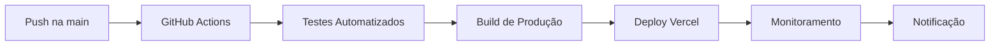

# 🚀 Guia de Deploy - Vytalle Estética

> **Deploy profissional com CI/CD, monitoramento e rollback automático**

## 📋 Índice

- [Visão Geral](#visão-geral)
- [Pré-requisitos](#pré-requisitos)
- [Configuração Inicial](#configuração-inicial)
- [Deploy Automático (CI/CD)](#deploy-automático-cicd)
- [Deploy Manual](#deploy-manual)
- [Configuração de Ambiente](#configuração-de-ambiente)
- [Monitoramento](#monitoramento)
- [Rollback](#rollback)
- [Troubleshooting](#troubleshooting)
- [Checklist de Deploy](#checklist-de-deploy)

---

## 🎯 Visão Geral

O Vytalle Estética usa **deploy automático** via GitHub Actions + Vercel, com:
- ✅ Deploy automático a cada push na `main`
- ✅ Preview automático para PRs
- ✅ Rollback instantâneo
- ✅ Monitoramento de performance
- ✅ Testes automatizados antes do deploy
- ✅ Validação de segurança

---

## 🛠️ Pré-requisitos

### Contas Necessárias

- [GitHub](https://github.com) - Repositório e CI/CD
- [Vercel](https://vercel.com) - Deploy e hosting
- [Supabase](https://supabase.com) - Banco de dados
- [GitHub Actions](https://github.com/features/actions) - Automação

### Ferramentas Locais

```bash
# Instale globalmente
npm install -g vercel
npm install -g supabase
npm install -g ngrok  # Para testes locais
```

---

## ⚙️ Configuração Inicial

### 1. Configuração do Vercel

```bash
# Login no Vercel
vercel login

# Link do projeto (primeira vez)
vercel link

# Configure variáveis de ambiente
vercel env add NEXT_PUBLIC_SUPABASE_URL
vercel env add NEXT_PUBLIC_SUPABASE_ANON_KEY
vercel env add SUPABASE_SERVICE_ROLE_KEY
vercel env add SUPABASE_DB_PASSWORD
vercel env add ADMIN_USERNAME
vercel env add ADMIN_PASSWORD
```

### 2. Configuração do Supabase

```bash
# Login no Supabase
supabase login

# Link do projeto
supabase link --project-ref YOUR_PROJECT_REF

# Aplique migrations
supabase db push
```

### 3. Configuração do GitHub

```bash
# Configure secrets no GitHub
# Settings > Secrets and variables > Actions

# Adicione os secrets:
# VERCEL_TOKEN
# VERCEL_ORG_ID
# VERCEL_PROJECT_ID
# SUPABASE_ACCESS_TOKEN
```

---

## 🔄 Deploy Automático (CI/CD)

### 1. Fluxo Automático



### 2. GitHub Actions Workflow

O projeto usa `.github/workflows/ci.yml`:

```yaml
name: CI/CD Pipeline

on:
  push:
    branches: [main]
  pull_request:
    branches: [main]

jobs:
  test:
    runs-on: ubuntu-latest
    steps:
      - uses: actions/checkout@v4
      - uses: actions/setup-node@v4
        with:
          node-version: '18'
      - run: npm ci
      - run: npm run test
      - run: npm run type-check
      - run: npm run lint

  deploy:
    needs: test
    runs-on: ubuntu-latest
    if: github.ref == 'refs/heads/main'
    steps:
      - uses: actions/checkout@v4
      - uses: actions/setup-node@v4
      - run: npm ci
      - run: npm run build
      - uses: amondnet/vercel-action@v25
        with:
          vercel-token: ${{ secrets.VERCEL_TOKEN }}
          vercel-org-id: ${{ secrets.VERCEL_ORG_ID }}
          vercel-project-id: ${{ secrets.VERCEL_PROJECT_ID }}
```

### 3. Deploy de Preview

Para PRs, o Vercel cria automaticamente:
- URL de preview única
- Build isolado
- Testes de integração
- Validação antes do merge

---

## 🛠️ Deploy Manual

### 1. Deploy Local

```bash
# Build de produção
npm run build

# Teste local
npm run start

# Deploy manual
vercel --prod
```

### 2. Deploy com Configurações Específicas

```bash
# Deploy com variáveis específicas
vercel --prod --env NEXT_PUBLIC_SUPABASE_URL=https://your-project.supabase.co

# Deploy para staging
vercel --env NODE_ENV=staging

# Deploy com configurações customizadas
vercel --prod --build-env NODE_ENV=production
```

### 3. Deploy de Emergência

```bash
# Deploy rápido (pula testes)
vercel --prod --force

# Deploy com rollback automático
vercel --prod --auto-alias
```

---

## 🔧 Configuração de Ambiente

### 1. Variáveis de Ambiente

| Ambiente | Arquivo | Descrição |
|----------|---------|-----------|
| **Desenvolvimento** | `.env.local` | Configurações locais |
| **Staging** | Vercel Dashboard | Ambiente de teste |
| **Produção** | Vercel Dashboard | Ambiente final |

### 2. Configuração por Ambiente

```bash
# Desenvolvimento
NODE_ENV=development
NEXT_PUBLIC_API_URL=http://localhost:3000

# Staging
NODE_ENV=staging
NEXT_PUBLIC_API_URL=https://staging.vytalle.vercel.app

# Produção
NODE_ENV=production
NEXT_PUBLIC_API_URL=https://vytalle-estetica.vercel.app
```

### 3. Secrets Sensíveis

```bash
# Nunca commite estes arquivos
.env.local
.env.production
.env.staging

# Use Vercel Dashboard para secrets
# https://vercel.com/dashboard/project/[id]/settings/environment-variables
```

---

## 📊 Monitoramento

### 1. Vercel Analytics

```typescript
// Monitoramento automático
// app/layout.tsx
import { Analytics } from '@vercel/analytics/react';

export default function RootLayout({ children }) {
  return (
    <html>
      <body>
        {children}
        <Analytics />
      </body>
    </html>
  );
}
```

### 2. Métricas Monitoradas

- **Performance**: LCP, FID, CLS
- **Erros**: 4xx, 5xx, JavaScript errors
- **Uso**: Page views, unique visitors
- **SEO**: Core Web Vitals
- **Funcionalidade**: API endpoints, database queries

### 3. Alertas Automáticos

```yaml
# .github/workflows/monitoring.yml
name: Monitoring Alerts

on:
  schedule:
    - cron: '0 */6 * * *'  # A cada 6 horas

jobs:
  health-check:
    runs-on: ubuntu-latest
    steps:
      - name: Check Production Health
        run: |
          curl -f https://vytalle-estetica.vercel.app/api/health
          if [ $? -ne 0 ]; then
            echo "Production is down!"
            exit 1
          fi
```

---

## 🔄 Rollback

### 1. Rollback Automático

```bash
# Via Vercel Dashboard
# Deployments > [deployment] > "Revert to this deployment"

# Via CLI
vercel rollback [deployment-id]
```

### 2. Rollback Manual

```bash
# Reverta o último commit
git revert HEAD
git push origin main

# Ou volte para uma tag específica
git checkout v1.2.0
git push origin main --force
```

### 3. Rollback de Banco de Dados

```bash
# Restaure backup do Supabase
supabase db reset --linked --yes

# Ou aplique migration específica
supabase db push --include-all
```

---

## 🔧 Troubleshooting

### 1. Deploy Falha

```bash
# Verifique logs
vercel logs [deployment-id]

# Verifique build local
npm run build

# Verifique variáveis de ambiente
vercel env ls

# Limpe cache
vercel --clear-cache
```

### 2. Build Falha

```bash
# Erro comum: TypeScript
npm run type-check

# Erro comum: Dependências
rm -rf node_modules package-lock.json
npm install

# Erro comum: Cache
rm -rf .next
npm run build
```

### 3. Performance Degradada

```bash
# Analise bundle
npm run analyze

# Verifique Core Web Vitals
# https://pagespeed.web.dev/

# Otimize imagens
npm run optimize-images
```

### 4. Banco de Dados

```bash
# Verifique conexão
supabase status

# Aplique migrations pendentes
supabase db push

# Verifique logs
supabase logs
```

---

## ✅ Checklist de Deploy

### Pré-Deploy

- [ ] **Testes**: Todos os testes passando
- [ ] **Build**: Build de produção sem warnings
- [ ] **TypeScript**: Sem erros de tipo
- [ ] **Lint**: Código formatado
- [ ] **Variáveis**: Todas as env configuradas
- [ ] **Banco**: Migrations aplicadas
- [ ] **Backup**: Backup do banco realizado

### Durante Deploy

- [ ] **CI/CD**: Pipeline executando
- [ ] **Build**: Build bem-sucedido
- [ ] **Deploy**: Deploy concluído
- [ ] **Health Check**: API respondendo
- [ ] **SSL**: HTTPS funcionando

### Pós-Deploy

- [ ] **Funcionalidade**: Features principais testadas
- [ ] **Performance**: Core Web Vitals OK
- [ ] **Mobile**: Responsividade verificada
- [ ] **SEO**: Meta tags corretas
- [ ] **Monitoramento**: Alertas configurados
- [ ] **Backup**: Backup pós-deploy

---

## 🚀 Comandos Rápidos

### Deploy Rápido

```bash
# Deploy completo
git add . && git commit -m "feat: nova funcionalidade" && git push

# Deploy manual
vercel --prod

# Deploy com preview
vercel
```

### Verificação Rápida

```bash
# Status do projeto
vercel ls

# Logs recentes
vercel logs

# Variáveis de ambiente
vercel env ls

# Domínios
vercel domains
```

### Rollback Rápido

```bash
# Último deploy
vercel rollback

# Deploy específico
vercel rollback [deployment-id]

# Via Git
git revert HEAD && git push
```

---

## 📞 Suporte de Deploy

### Contatos de Emergência

- **DevOps**: contato.ferreirag@outlook.com

- **Vercel Support**: https://vercel.com/support
- **Supabase Support**: https://supabase.com/support

### Recursos Úteis

- [Vercel Docs](https://vercel.com/docs)
- [Supabase Docs](https://supabase.com/docs)
- [GitHub Actions](https://docs.github.com/en/actions)
- [Next.js Deployment](https://nextjs.org/docs/deployment)

---

## 🏆 Boas Práticas

### 1. Deploy Seguro

- Sempre teste em staging primeiro
- Use feature flags para releases graduais
- Mantenha backups antes de deploys grandes
- Monitore métricas pós-deploy

### 2. Performance

- Otimize imagens antes do deploy
- Use lazy loading para componentes pesados
- Implemente cache adequado
- Monitore Core Web Vitals

### 3. Segurança

- Nunca commite secrets
- Use HTTPS sempre
- Implemente rate limiting
- Monitore logs de segurança

### 4. Monitoramento

- Configure alertas para downtime
- Monitore performance em tempo real
- Acompanhe métricas de negócio
- Documente incidentes

---

**Deploy profissional, sempre! 🚀** 