# 📊 Diagramas da Arquitetura - Vytalle Estética

> **Diagramas técnicos detalhados e fiéis ao projeto atual**

## 📋 Índice

- [Arquitetura Geral](#arquitetura-geral)
- [Fluxo de Dados](#fluxo-de-dados)
- [Estrutura de Componentes](#estrutura-de-componentes)
- [Fluxo de Autenticação](#fluxo-de-autenticação)
- [Fluxo de Checkout](#fluxo-de-checkout)
- [Estrutura do Banco](#estrutura-do-banco)
- [Fluxo de Testes](#fluxo-de-testes)
- [Deploy e CI/CD](#deploy-e-cicd)

---

## 🏗️ Arquitetura Geral

### Visão de Alto Nível

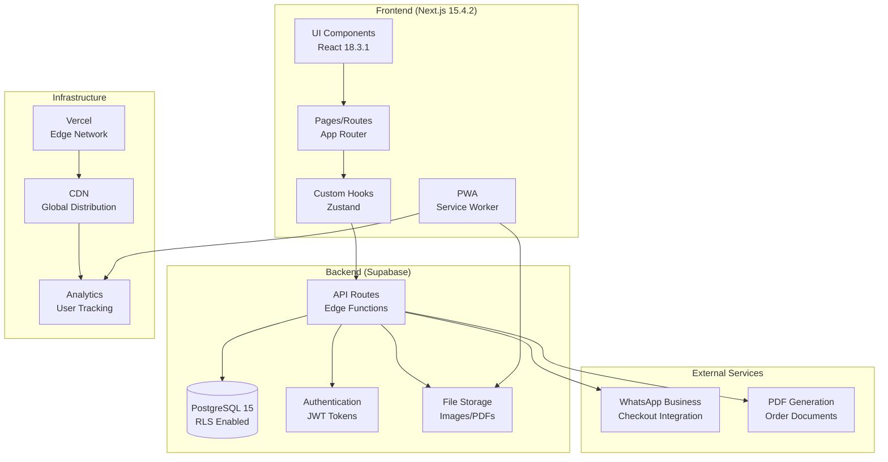

### Stack Tecnológica Detalhada

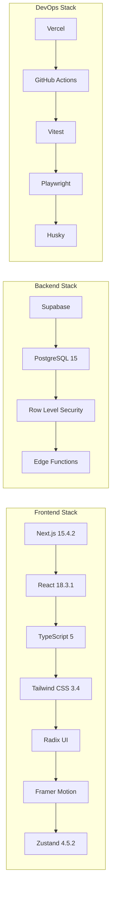

---

## 🔄 Fluxo de Dados

### Fluxo Principal da Aplicação

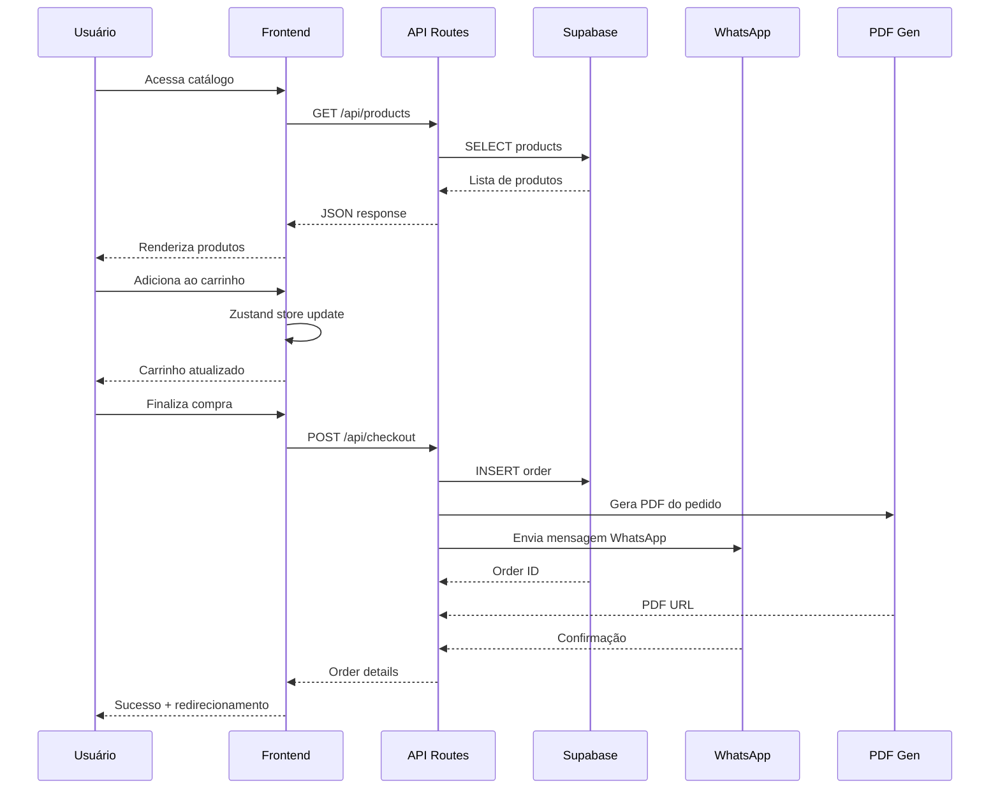

### Fluxo de Estado (Zustand)

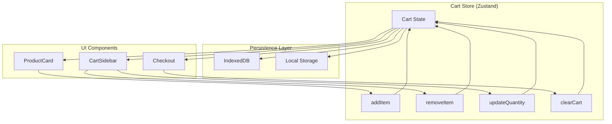

---

## 🧩 Estrutura de Componentes

### Hierarquia de Componentes

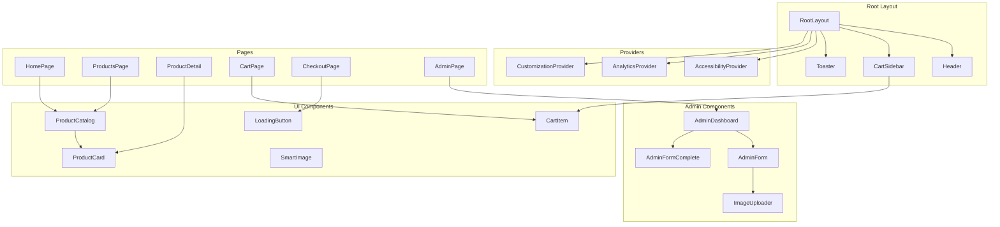

### Fluxo de Props e Estado

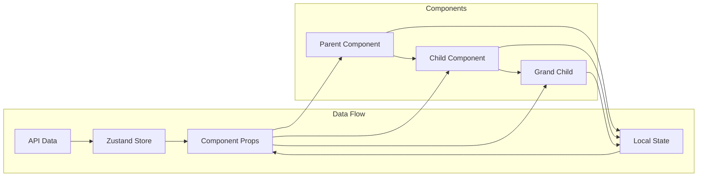

---

## 🔐 Fluxo de Autenticação

### Autenticação Admin

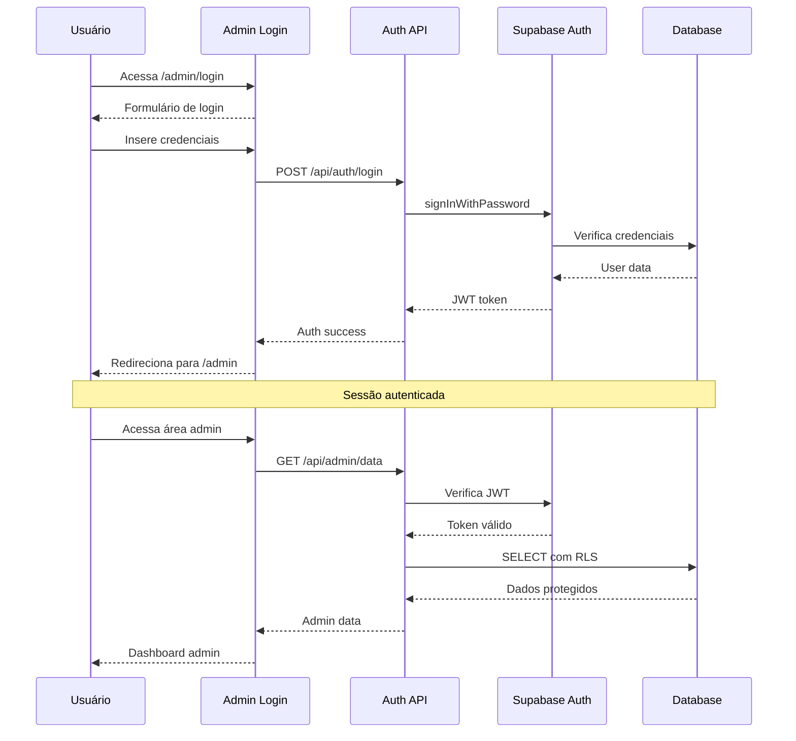

### Row Level Security (RLS)

```mermaid
graph TD
    subgraph "Database Tables"
        Products[Products Table]
        Orders[Orders Table]
        Users[Users Table]
    end

    subgraph "RLS Policies"
        PublicRead[Public Read<br/>Products.active = true]
        AuthInsert[Auth Insert<br/>auth.role() = 'authenticated']
        AuthUpdate[Auth Update<br/>auth.role() = 'authenticated']
        AuthDelete[Auth Delete<br/>auth.role() = 'authenticated']
        AdminOnly[Admin Only<br/>auth.jwt() ->> 'role' = 'admin']
    end

    subgraph "Access Control"
        Anonymous[Anonymous Users]
        Authenticated[Authenticated Users]
        Admin[Admin Users]
    end

    Anonymous --> PublicRead
    PublicRead --> Products

    Authenticated --> AuthInsert
    Authenticated --> AuthUpdate
    AuthInsert --> Orders
    AuthUpdate --> Products

    Admin --> AdminOnly
    AdminOnly --> Users
    AdminOnly --> Orders
```

---

## 🛒 Fluxo de Checkout

### Processo Completo de Compra

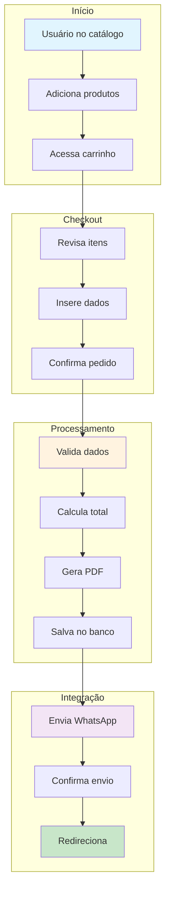

### Estrutura da Mensagem WhatsApp

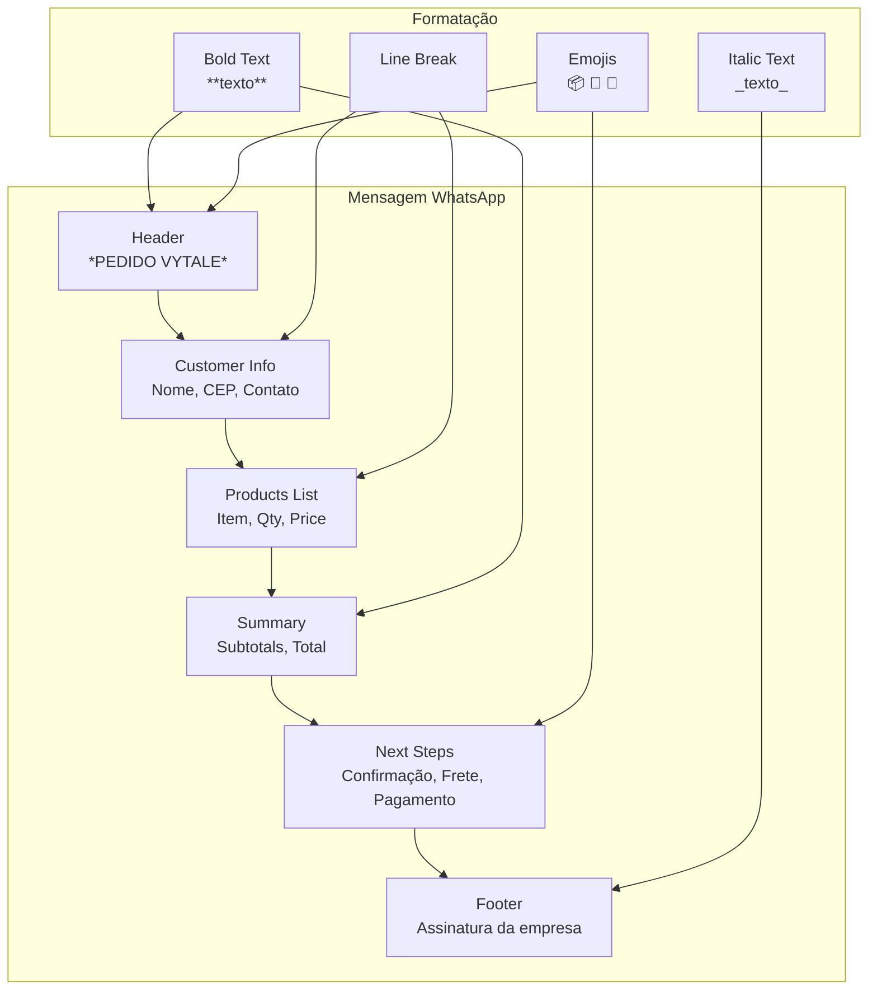

---

## 🗄️ Estrutura do Banco

### Schema do Banco de Dados

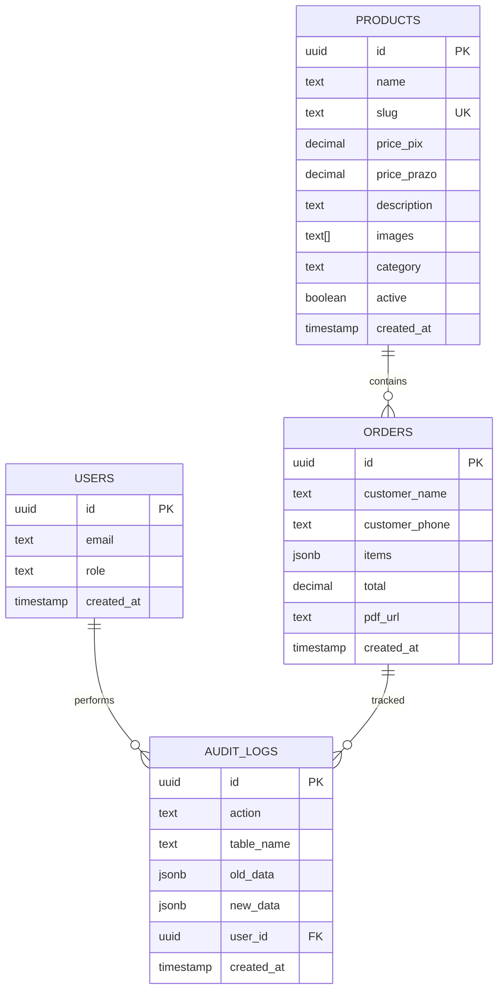

### Relacionamentos e Constraints

```mermaid
graph TD
    subgraph "Primary Keys"
        PK1[Products.id<br/>UUID PRIMARY KEY]
        PK2[Orders.id<br/>UUID PRIMARY KEY]
        PK3[Users.id<br/>UUID PRIMARY KEY]
    end

    subgraph "Foreign Keys"
        FK1[AuditLogs.user_id<br/>REFERENCES Users.id]
        FK2[AuditLogs.order_id<br/>REFERENCES Orders.id]
    end

    subgraph "Unique Constraints"
        UK1[Products.slug<br/>UNIQUE NOT NULL]
        UK2[Users.email<br/>UNIQUE NOT NULL]
    end

    subgraph "Check Constraints"
        CC1[Products.category<br/>IN ('Toxina Botulínica', 'Bioestimulador', ...)]
        CC2[Products.price_pix<br/>> 0]
        CC3[Products.price_prazo<br/>> 0]
    end

    subgraph "Default Values"
        DV1[Products.active<br/>DEFAULT TRUE]
        DV2[Products.created_at<br/>DEFAULT NOW()]
        DV3[Orders.created_at<br/>DEFAULT NOW()]
    end

    PK1 --> FK1
    PK2 --> FK2
    PK3 --> FK1

    UK1 --> CC1
    UK2 --> CC2
    CC3 --> DV1
    DV2 --> DV3
```

---

## 🧪 Fluxo de Testes

### Estrutura de Testes

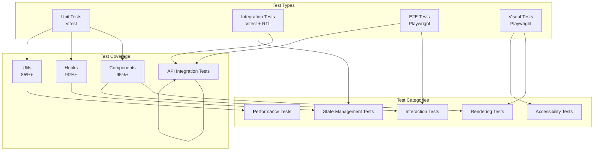

### Pipeline de Testes

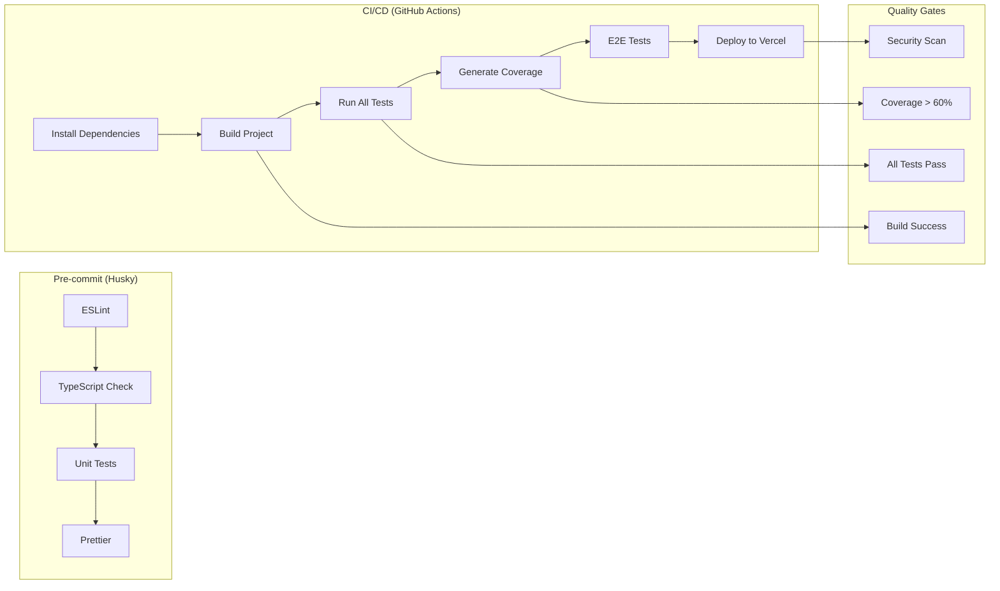

---

## 🚀 Deploy e CI/CD

### Pipeline de Deploy

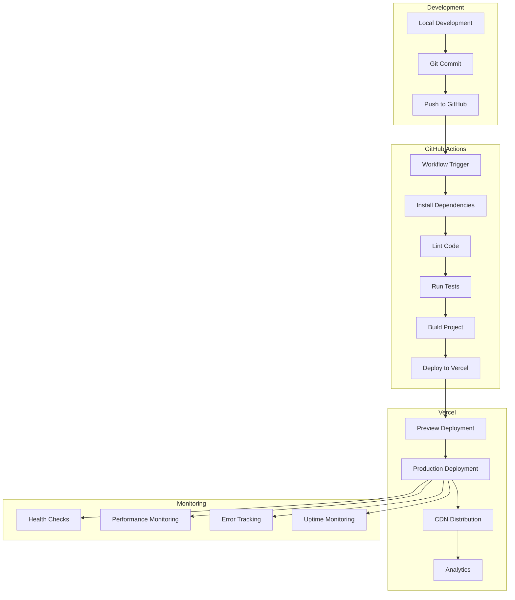

### Estrutura de Ambientes

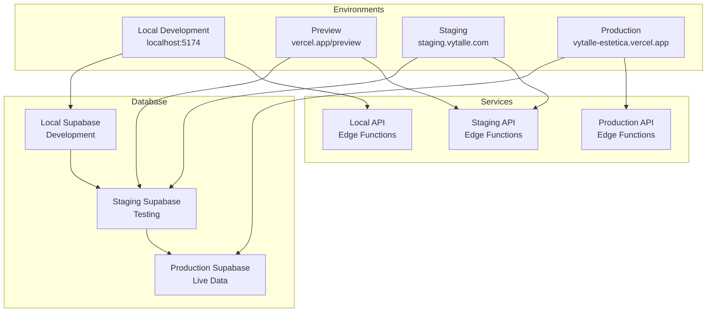

---

## 📊 Métricas e Monitoramento

### Dashboard de Performance

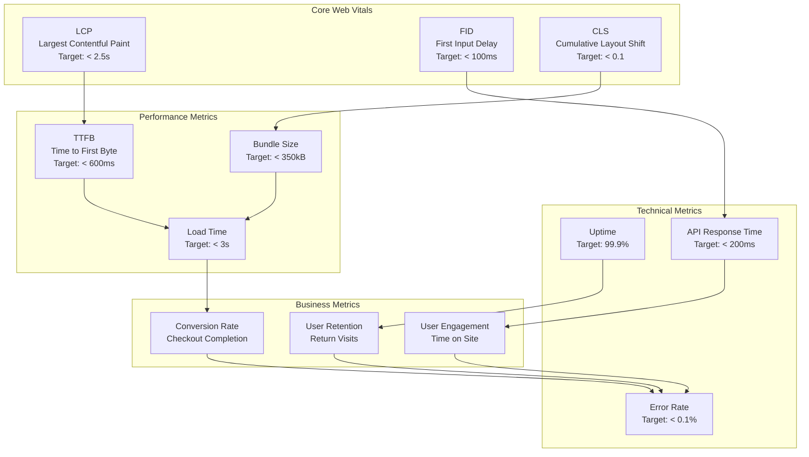

---

## 🔧 Configuração e Setup

### Variáveis de Ambiente

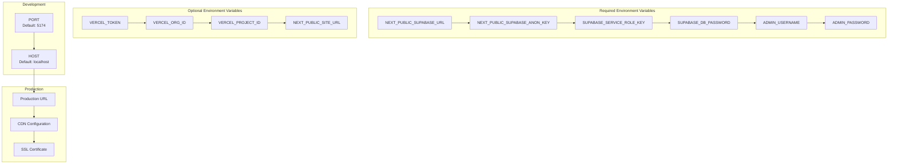

---

## 📱 PWA e Mobile

### Estrutura PWA

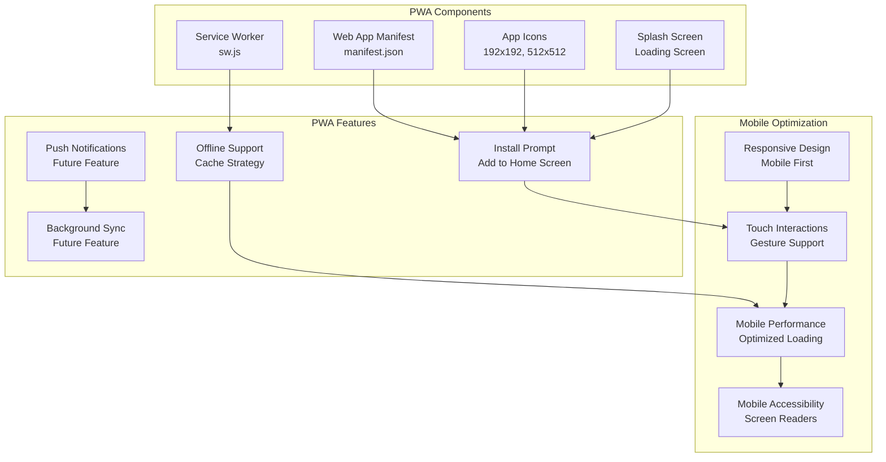

---

## 🔒 Segurança e Compliance

### Camadas de Segurança

```mermaid
graph TD
    subgraph "Frontend Security"
        CSP[Content Security Policy<br/>CSP Headers]
        HTTPS[HTTPS Only<br/>SSL/TLS]
        XSS[XSS Protection<br/>Input Sanitization]
        CSRF[CSRF Protection<br/>Token Validation]
    end

    subgraph "Backend Security"
        RLS[Row Level Security<br/>Database Policies]
        Auth[JWT Authentication<br/>Token Management]
        RateLimit[Rate Limiting<br/>Request Throttling]
        Validation[Input Validation<br/>Data Sanitization]
    end

    subgraph "Infrastructure Security"
        Headers[Security Headers<br/>HSTS, X-Frame-Options]
        WAF[Web Application Firewall<br/>DDoS Protection]
        Monitoring[Security Monitoring<br/>Threat Detection]
        Backup[Data Backup<br/>Disaster Recovery]
    end

    subgraph "Compliance"
        LGPD[LGPD Compliance<br/>Data Protection]
        GDPR[GDPR Ready<br/>Privacy Controls]
        Audit[Audit Logging<br/>Activity Tracking]
        Encryption[Data Encryption<br/>At Rest & In Transit]
    end

    CSP --> HTTPS
    HTTPS --> XSS
    XSS --> CSRF

    RLS --> Auth
    Auth --> RateLimit
    RateLimit --> Validation

    Headers --> WAF
    WAF --> Monitoring
    Monitoring --> Backup

    LGPD --> GDPR
    GDPR --> Audit
    Audit --> Encryption
```

---

## 📈 Escalabilidade

### Arquitetura Escalável

```mermaid
graph TD
    subgraph "Current Architecture"
        SingleApp[Single Next.js App]
        SingleDB[Single Supabase Instance]
        SingleCDN[Vercel CDN]
    end

    subgraph "Scalability Path"
        Microservices[Microservices<br/>API Separation]
        Sharding[Database Sharding<br/>Horizontal Partitioning]
        LoadBalancer[Load Balancer<br/>Traffic Distribution]
        Caching[Redis Caching<br/>Session & Data]
    end

    subgraph "Future Scaling"
        MultiRegion[Multi-Region Deployment<br/>Global Distribution]
        AutoScaling[Auto Scaling<br/>Dynamic Resources]
        EventDriven[Event-Driven Architecture<br/>Message Queues]
        Containerization[Container Orchestration<br/>Kubernetes]
    end

    SingleApp --> Microservices
    SingleDB --> Sharding
    SingleCDN --> LoadBalancer

    Microservices --> Caching
    Sharding --> MultiRegion
    LoadBalancer --> AutoScaling

    Caching --> EventDriven
    MultiRegion --> Containerization
    AutoScaling --> Containerization
```

---

## 🎯 Conclusão

Estes diagramas representam fielmente a arquitetura atual do projeto Vytalle Estética, incluindo:

- **Arquitetura em camadas** com separação clara de responsabilidades
- **Fluxos de dados** detalhados entre componentes
- **Estrutura de banco** com relacionamentos e constraints
- **Pipeline de CI/CD** completo
- **Medidas de segurança** em múltiplas camadas
- **Estratégias de escalabilidade** para crescimento futuro

Todos os diagramas são baseados no código real do projeto e refletem as decisões arquiteturais implementadas.
